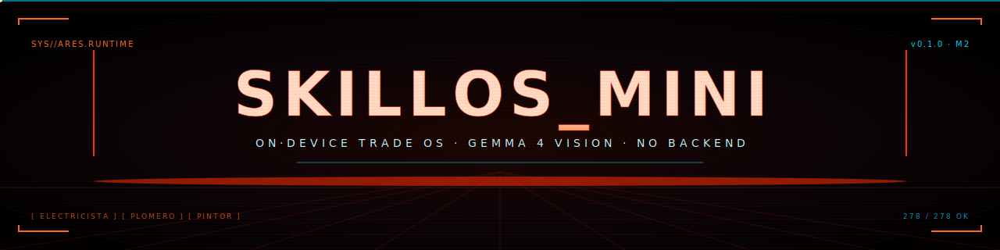

<!--
  README — skillos_mini
  Tron Ares aesthetic. Black + neon orange (Ares signature) + cyan accents.
  GitHub renders the SVG banners below natively (SMIL animations included).
-->

<p align="center">
  
</p>

<p align="center">
  <strong><code>SKILLOS_MINI</code></strong> &nbsp;//&nbsp; on-device, mobile-first agentic OS for tradespeople.<br/>
  <sub>Capture · diagnose · share. Photos never leave the device until <em>you</em> share them.</sub>
</p>

<p align="center">
  <a href="#"></a>
  <a href="#"></a>
  <a href="LICENSE"></a>
  <a href="#"></a>
</p>

<p align="center">
  
</p>

## ▸ what this is

skillos_mini is two things at once:

1. **A reusable on-device runtime.** Svelte 5 + Capacitor + on-device LLM
   (Gemma 4 via LiteRT on Android, wllama WASM elsewhere) wrapped around
   the **cartridge model** — sealed per-domain bundles with JSON-Schema
   contracts and **deterministic validators** that enforce rules in code,
   not in prompts.
2. **A trade-app vertical** for Spanish-speaking tradespeople (Uruguay
   first), with three production cartridges:
   - <kbd>⚡ ELECTRICISTA</kbd> — IEC 60364 / UTE compliance + repair safety.
   - <kbd>🔧 PLOMERO</kbd> — urgencia-first vision diagnostic + obra quoting.
   - <kbd>🎨 PINTOR</kbd> — auto portfolio (antes/después) + presupuesto por m².

> The runtime is the moat. The cartridges are how it ships.

<p align="center">
  
</p>

## ▸ why this matters now (april 2026)

Anthropic shipped Agent Skills as a first-class concept; Google AI Edge
Gallery shipped Agent Skills on-device with Gemma 4. **"Skills as markdown"
is now a commodity.** What still isn't:

- Sealed cartridge bundles with **deterministic validators** in code.
  Gemma 4 proposes problem categories; `compliance_checker.py` enforces
  IEC 60364. The LLM never decides "is RCD required" — that's a table
  lookup.
- A real on-device flow that produces a **printable, branded PDF** the
  trade can send to the client by WhatsApp without a server.
- Multimodal vision diagnosis that runs **on the phone**, with photos
  that never leave the device until the trade explicitly shares them.

That's what skillos_mini ships.

<p align="center">
  
</p>

## ▸ demo loop · 60 seconds

```
┌──[ ELECTRICISTA · ARES.RUNTIME ]──────────────────────────────────────┐
│                                                                        │
│  1. open app → onboarding picks "Electricista"                         │
│  2. profile: name, matrícula UTE, phone, RUT, logo                     │
│  3. HomeScreen banner glows electricista-red → tap "Nuevo trabajo"     │
│                                                                        │
│  ▸ camera shutter → 1–3 fotos                                          │
│  ▸ tap "Continuar" → "Auto-diagnóstico"                                │
│       └── Gemma 4 vision runs on-device, fills textareas in es-UY      │
│  ▸ tap 🎤 to dictate more (live STT, no internet)                      │
│  ▸ tap "Generar reporte" → pdfmake renders branded PDF on-device       │
│  ▸ tap "Compartir por WhatsApp" → system sheet → contacto              │
│                                                                        │
│  4. job persists in IndexedDB → tomorrow shows under                   │
│     "Trabajos recientes" → tap to re-share                             │
│                                                                        │
│  ▸ switch to PINTOR → same data, portfolio mode (antes/después grid)   │
│     same engine, different surface, ZERO code change in the cartridge  │
│                                                                        │
└────────────────────────────────────────────────────────────────────────┘
```

The whole loop runs **without any backend**. The model download CDN and
the cartridge data refresh URL are the *only* outbound calls allowed at
app start.

<p align="center">
  
</p>

## ▸ what's in the box

### three production cartridges

| Cartridge | Default flow | Validators | Local data |
|---|---|---|---|
| `trade-electricista` | `intervention`, `quote_only` | `compliance_checker.py` (IEC 60364), `repair_safety.py` | Genrod, Sica, Roker, Plastix |
| `trade-plomero` | `urgencia` (default), `obra` | `plumbing_checker.py` (slope ≥ 1%, fixture diameters, pressure-test) | FV, Loto, Hidromet, Rotoplas |
| `trade-pintor` | `presupuesto`, `trabajo` | `painting_sanity.py` (drying time, coverage, prep gate) | Sherwin Williams, Inca, Sinteplast, Kolor |

Plus a `_shared/` library of common schemas + agent prompts the
cartridges depend on.

### provider abstraction

The shell and runtime never import Capacitor APIs directly. Five
interfaces in `mobile/src/lib/providers/`:

```
  ┌──────────────┐  ┌────────────────┐  ┌──────────────┐
  │ MediaProvider│  │ StorageProvider│  │ ShareProvider│
  └──────────────┘  └────────────────┘  └──────────────┘
  ┌──────────────┐  ┌────────────────┐
  │ GeoProvider  │  │ SpeechProvider │      • Capacitor (Android prod)
  └──────────────┘  └────────────────┘      • Web      (dev / preview)
                                            • Mock     (Vitest)
```

`getProviders()` picks the right one for the platform.

### llm stack

- **Cloud** — OpenAI-compatible providers (Gemini OpenAI compat,
  OpenRouter with GPT-4V or Claude). Multimodal `ChatMessage.images` is
  rewritten into `content: [{type:"text"},{type:"image_url"}]`.
- **Local** — **LiteRT-LM 0.2** on Android with **Gemma 4 E2B/E4B
  vision**. When the loaded model declares `vision: true`, the plugin
  enables the vision modality on session creation, decodes base64 photos
  to Bitmaps, wraps as MPImages, and attaches via `addImage()` before
  generation.
- **WASM fallback** — wllama (text-only) for older Android and desktop.

### runtime + ui shell

- Cartridge runtime: TS port of the original Python runtime — manifest
  parser, blackboard, schema validators (Ajv), agent prompts, flow
  execution, fallback routing.
- Five screens (per [`CLAUDE.md`](CLAUDE.md) §5): **Home**, **Capture**,
  **Job**, **Quote/Report**, **Library**.

<p align="center">
  
</p>

## ▸ repo layout

```
skillos_mini/
├── CLAUDE.md                        ← Source-of-truth dev guide. Read first.
├── README.md                        ← This file.
├── docs/
│   ├── ARCHITECTURE.md              ← System architecture + mermaid diagrams.
│   ├── TUTORIAL.md                  ← Build your first cartridge in 30 min.
│   ├── USAGE.md                     ← End-user guide for tradespeople.
│   └── assets/                      ← Animated SVG banners + dividers.
├── cartridges/
│   ├── _shared/                     ← Common schemas + agent prompts.
│   ├── trade-electricista/
│   ├── trade-plomero/
│   ├── trade-pintor/
│   ├── residential-electrical/      ← Original IEC 60364 design cartridge.
│   ├── cooking/  demo/  learn/      ← Legacy non-trade cartridges.
└── mobile/
    ├── capacitor-plugins/litert-lm/ ← Native LiteRT-LM Android plugin.
    ├── src/
    │   ├── lib/
    │   │   ├── cartridge/           ← Runtime + validators.
    │   │   ├── llm/                 ← Cloud + local LLM clients.
    │   │   ├── providers/           ← Media/Storage/Share/Geo/Speech.
    │   │   ├── report/              ← pdf.ts + quote_pdf.ts.
    │   │   ├── state/               ← Svelte 5 rune stores.
    │   │   └── storage/             ← IndexedDB.
    │   └── components/              ← TradeFlowSheet, JobsList, etc.
    └── tests/                       ← 278 vitest cases.
```

<p align="center">
  
</p>

## ▸ quick start

```bash
git clone https://github.com/EvolvingAgentsLabs/skillos_mini.git
cd skillos_mini/mobile
npm install
npm run seed         # Seeds cartridges into a manifest the app reads at boot.
npm run dev          # Vite dev server. Open http://localhost:5173.
npm test             # 278 vitest cases.
npm run check        # svelte-check (TypeScript + Svelte).
```

Build the Android APK:

```bash
cd mobile
npx cap add android  # only first time
npx cap sync android
npx cap open android # opens Android Studio
```

See [`docs/USAGE.md`](docs/USAGE.md) to use the app, or
[`docs/TUTORIAL.md`](docs/TUTORIAL.md) to author your own cartridge.

<p align="center">
  
</p>

## ▸ what's not built yet

<details>
<summary><kbd>▶ click to expand</kbd></summary>

- **iOS app** — gated until Capacitor LiteRT iOS lands ([`CLAUDE.md`](CLAUDE.md) §3.3).
- **Cloud sync / backup** — planned for v1.1.
- **Dataset upload pipeline** — planned for v1.2 (see [`CLAUDE.md`](CLAUDE.md) §10).
- **Live token streaming** in the trade-flow Review screen — the LLM call
  itself streams; the UI surfaces only the final transcript today.

</details>

## ▸ status

```
  ┌──────────────────────────────────────────────────────────────┐
  │  TESTS         ▰▰▰▰▰▰▰▰▰▰▰▰▰▰▰▰▰▰▰▰▰▰▰▰▰▰▰▰▰▰  278 / 278 OK  │
  │  SVELTE-CHECK  ▰▰▰▰▰▰▰▰▰▰▰▰▰▰▰▰▰▰▰▰▰▰▰▰▰▰▰▰▰▰      0 ERRORS  │
  │  MILESTONE                                            v0.1.0 │
  │  STATUS                  feature-complete · awaiting device  │
  └──────────────────────────────────────────────────────────────┘
```

v0.1.0 (M2 milestone in [`CLAUDE.md`](CLAUDE.md) §8) is feature-complete
in code; pending real-device validation against the §9.1 performance
budgets.

## ▸ license

Apache 2.0 for the runtime.
Trade cartridges with audited regulatory validators may be dual-licensed
in the future (open-core pattern) — see [`CLAUDE.md`](CLAUDE.md) §13.

## ▸ reading order

1. [`CLAUDE.md`](CLAUDE.md) — source-of-truth development guide. Read this
   first. §1–§4 is the *why*; §6–§8 is *what to do next*.
2. [`docs/ARCHITECTURE.md`](docs/ARCHITECTURE.md) — system architecture +
   data flow diagrams.
3. [`docs/USAGE.md`](docs/USAGE.md) — end-user walkthrough.
4. [`docs/TUTORIAL.md`](docs/TUTORIAL.md) — author your own cartridge.

<p align="center">
  
</p>

<p align="center">
  
</p>

<p align="center">
  <sub><code>// END_OF_TRANSMISSION  ·  ARES.RUNTIME // v0.1.0</code></sub>
</p>
