<p align="center">
  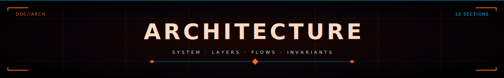
</p>

<p align="center">
  <strong>skillos_mini</strong> &nbsp;//&nbsp; software architecture &nbsp;//&nbsp; <code>v0.1.0</code>
</p>

<p align="center">
  
</p>

> Companion to [`CLAUDE.md`](../CLAUDE.md). The CLAUDE.md is the *contract*
> (what we will and won't build). This file is the *map* (what's wired to
> what, with diagrams).

---

## ▸ §1 system overview

skillos_mini is an on-device, mobile-first agentic OS for tradespeople.
The app shell is a Svelte 5 + Capacitor application that orchestrates
domain-specific **cartridges** (sealed bundles of schemas + validators +
prompts + local data) through a **runtime** that runs entirely on the
user's phone.

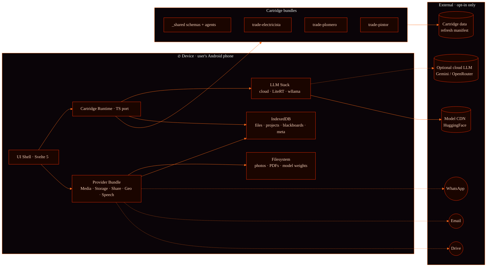

**The dotted lines are user-triggered traffic only.** Per CLAUDE.md §9.3
(privacy invariants), no outbound traffic carries blackboard contents
unless the user has tapped Share, configured a cloud LLM, or (post-v1.2)
opted into dataset contribution.

<p align="center">
  
</p>

## ▸ §2 the cartridge model

A cartridge is a directory under `cartridges/<name>/` with a fixed shape
the runtime understands. The trade cartridges all follow this layout:

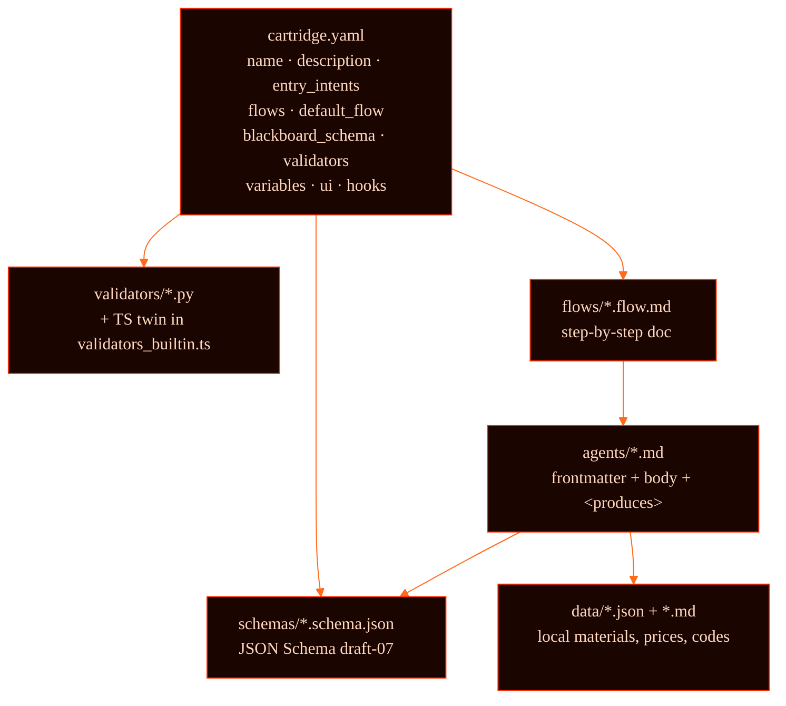

### what `ui:` and `hooks:` add

CLAUDE.md §4.1 introduced two additive optional blocks in
`cartridge.yaml`:

```yaml
ui:
  brand_color: "#2563EB"
  emoji: "⚡"
  primary_action:
    label: "Nuevo trabajo"
    flow: intervention
  secondary_actions:
    - { label: "Sólo presupuestar", flow: quote_only }
  library_default_mode: list   # or "portfolio"

hooks:
  on_quote_generated: [{ send_to_blackboard: client_message }]
  on_job_closed:
    - { generate_report: true }
    - { prompt_corpus_consent: false }
```

The **shell** consumes both. The cartridge knows nothing about Capacitor,
Svelte, or any mobile API — it's a portable bundle of declarative data.

### validators · source-of-truth in code, not prompt

Every regulated check ships as a `.py` file (canonical, reviewable like
any code) + a TS port in `mobile/src/lib/cartridge/validators_builtin.ts`
keyed by filename. The mobile runtime indexes the registry at runtime.

Example — `repair_safety.py` (electricista):

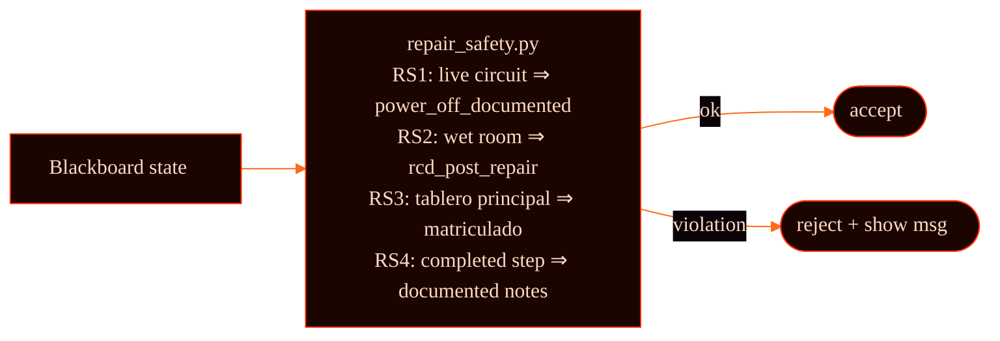

A rule update (e.g. new IEC edition) is a Python diff, not a prompt
rewrite — and it's reviewable like any other code change.

<p align="center">
  
</p>

## ▸ §3 layered architecture

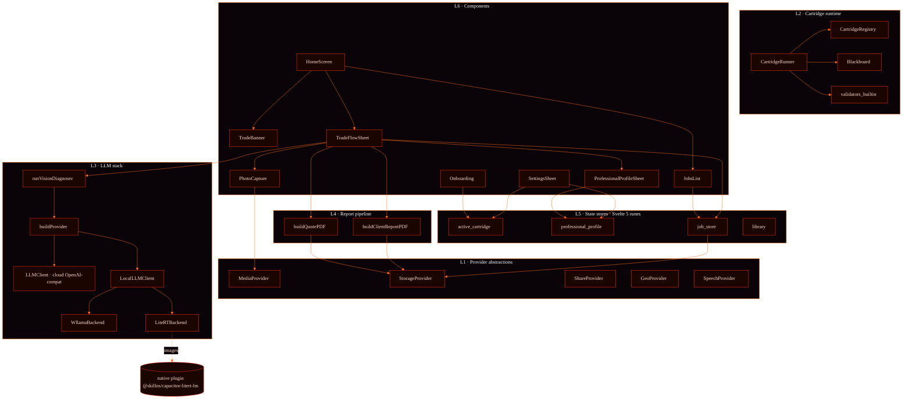

The strict rule (CLAUDE.md §4.3): **layers 2-6 never import `@capacitor/*`
directly.** They go through Layer 1 provider interfaces. The Capacitor
adapter is the *only* Capacitor consumer.

<p align="center">
  
</p>

## ▸ §4 the trade-app loop · sequence

This is the killer flow Daniel (electricista), Mauricio (plomero) and
Verónica (pintora) asked for in the simulated interviews.

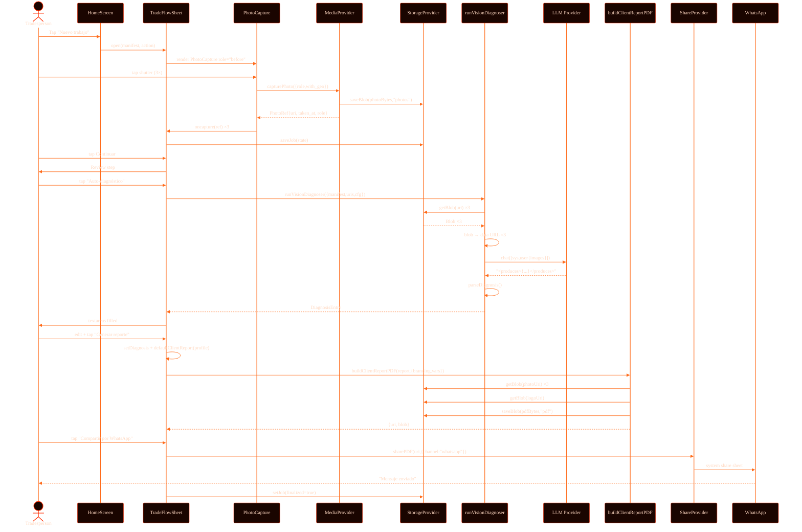

Notes:
- **No backend.** The only outbound traffic is whatever the user sends
  through WhatsApp (their choice) and (optionally) the LLM call to a
  cloud provider they configured per-project.
- **Resumable.** `saveJob` runs at every state change, so dropping the
  app mid-flow and reopening on the Job Library re-enters at the right
  step (`resumeStepFor`).

<p align="center">
  
</p>

## ▸ §5 the vision pipeline · CLAUDE.md §7.3

Two paths share the same call site. Whichever provider the user
configured per-project is what runs.

```mermaid
%%{init: {'theme':'base', 'themeVariables': {'primaryColor':'#1a0500','primaryTextColor':'#ffd9c2','primaryBorderColor':'#ff2d00','lineColor':'#ff6b1a','secondaryColor':'#001a24','tertiaryColor':'#0a0408','background':'#0a0408','mainBkg':'#1a0500','clusterBkg':'#0a0408','edgeLabelBackground':'#0a0408','fontFamily':'ui-monospace, monospace'}}}%%
flowchart LR
    User[User taps Auto-diagnóstico] --> Run[runVisionDiagnoser]
    Run --> Storage[StorageProvider.getBlob]
    Storage --> Encode[Blob → data URL]
    Encode --> Msg["ChatMessage<br/>{role:user,<br/>content,<br/>images: data URL[]}"]
    Msg --> Build[buildProvider]

    Build --> Branch{providerCfg.providerId}
    Branch -- "gemini / openrouter-*" --> CloudPath[LLMClient cloud]
    Branch -- "litert-local" --> LocalPath[LocalLLMClient · LiteRTBackend]
    Branch -- "wllama-local" --> Drop[wllama drops images<br/>warn upstream]

    CloudPath --> Serialize["serializeMessage<br/>content array shape"]
    Serialize --> CloudAPI[("Gemini OpenAI compat<br/>OpenRouter GPT-4V<br/>Claude via OpenRouter")]

    LocalPath --> Strip["extractImagePayloads<br/>strip data: prefix"]
    Strip --> Plugin[("native Android plugin<br/>@skillos/capacitor-litert-lm")]
    Plugin --> Kotlin[LiteRTLMPlugin.kt]
    Kotlin --> SessionAPI["LlmInferenceSession<br/>+ enableVisionModality"]
    SessionAPI --> Bitmap[Base64 → Bitmap → MPImage]
    Bitmap --> Generate[generateResponseAsync]
    Generate --> Tokens[token events]

    CloudAPI --> Parse["parseDiagnosis<br/>tagged · fenced · bare-JSON"]
    Tokens --> Parse
    Parse --> Result[DiagnosisEntry]
```

### what unlocks each path

| Path | Model | Where vision runs | Photos leave the device? |
|---|---|---|---|
| Cloud | Gemini 3.x / GPT-4V / Claude | Provider's GPU | **Yes** (encrypted to provider only) |
| Local | Gemma 4 E2B / E4B (.litertlm) | Phone NPU/GPU/CPU | **No** |
| WASM | wllama (text only) | Phone CPU | N/A — images dropped |

The trade picks per-project (Settings → Provider). The default is **off**
— no cloud LLM auto-runs (CLAUDE.md §12). Gemma 4 local is the privacy-
preserving recommendation; cloud is a fallback for older devices.

<p align="center">
  
</p>

## ▸ §6 data flow · what's persisted where

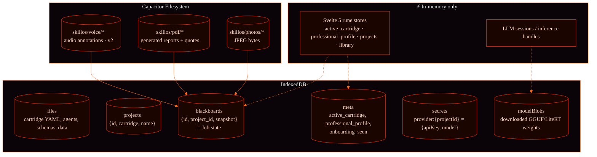

The mapping `Job ↔ BlackboardRecord`:

| JobState field | Snapshot key | Schema |
|---|---|---|
| `photos[]` | `photo_set.photos` | `photo_set.schema.json` |
| `diagnosis` | `diagnosis` | `diagnosis.schema.json` |
| `quote` | `quote` | `quote.schema.json` |
| `client_report` | `client_report` | `client_report.schema.json` |
| `finalized` | `finalized` | bool |
| `updated_at` | `updated_at` | ISO datetime |

Photos are **refs** (`uri: "capacitor-fs://skillos/photos/<id>"`). The
Filesystem is the source of truth for bytes; IndexedDB only stores
references and metadata.

<p align="center">
  
</p>

## ▸ §7 state machine · the trade flow

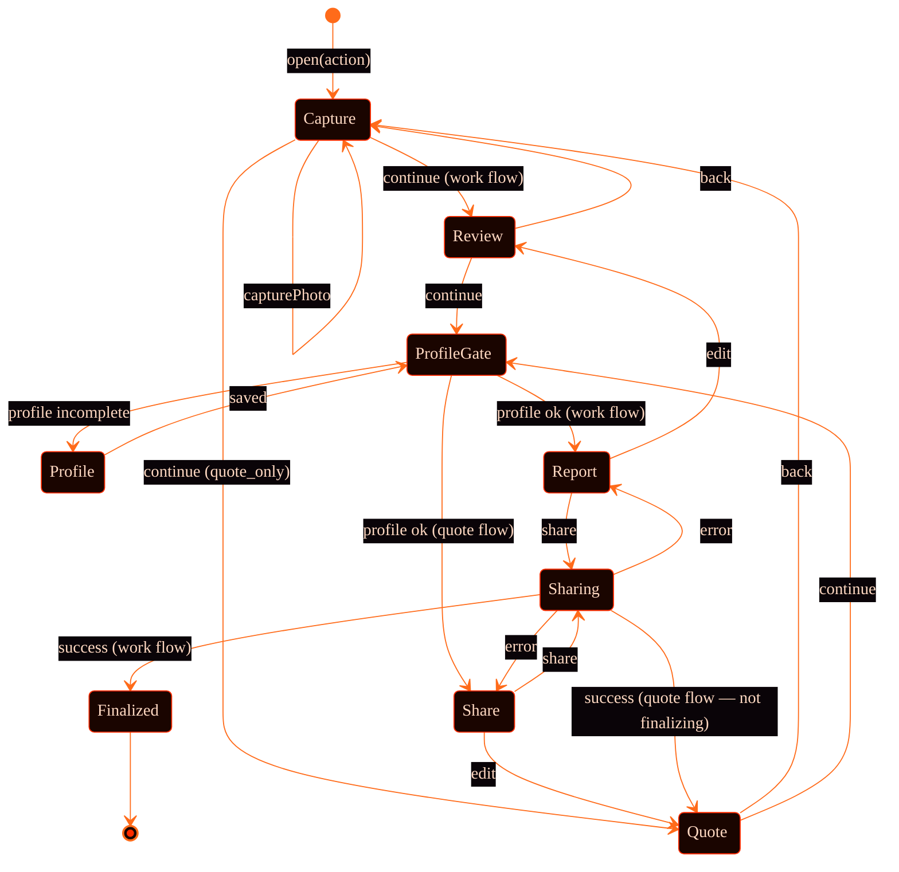

`ProfileGate` is the rule "no PDF until you have a credible footer"
(CLAUDE.md §14 Q3). It opens `ProfessionalProfileSheet` with
`require_complete=true` if `name|business + phone` is missing.

The quote share **does not** finalize — the trade can return later, do
the work, and ship a final report from the same job.

<p align="center">
  
</p>

## ▸ §8 build pipeline

### web dev

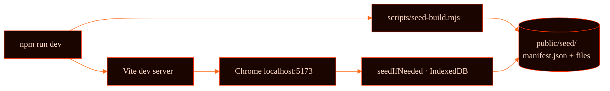

The `seed-build.mjs` script walks `cartridges/` + `system/` + selected
`projects/` and produces `public/seed/manifest.json` + the bundled file
contents. The Vite dev server serves it; `seedIfNeeded()` reads it on
first load and writes everything into IndexedDB so the runtime sees
files-on-disk semantics.

### android apk

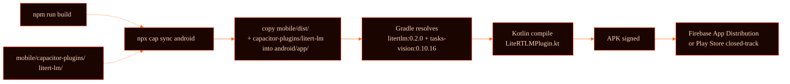

CLAUDE.md §3.3 keeps iOS off the table for now; the iOS plugin is a
stub.

<p align="center">
  
</p>

## ▸ §9 cross-cutting invariants

These are CLAUDE.md §9.3 made operational.

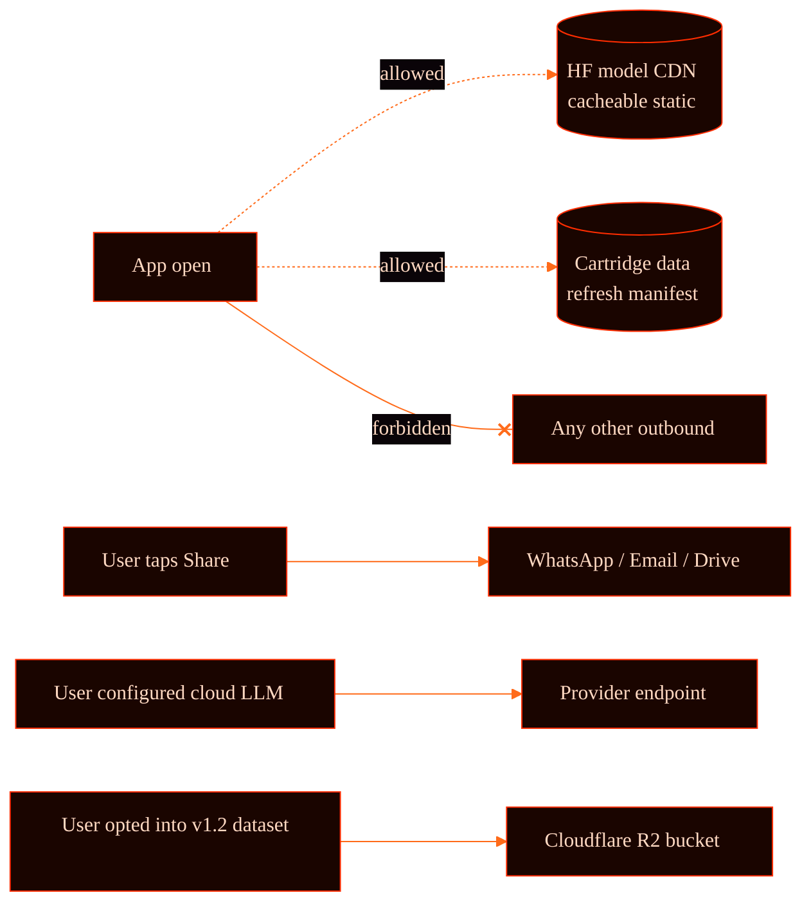

The invariants the test suite enforces:
- `MockShareProvider.shared[]` only fills when explicit `sharePDF` calls
  it.
- `extractImagePayloads()` rejects `http(s)` URLs (privacy gate when the
  cloud serializer encounters a remote URL).
- `professional_profile.svelte.ts` normalizes/trims so empty fields
  never leak into a PDF footer the user never reviewed.

<p align="center">
  
</p>

## ▸ §10 test coverage map

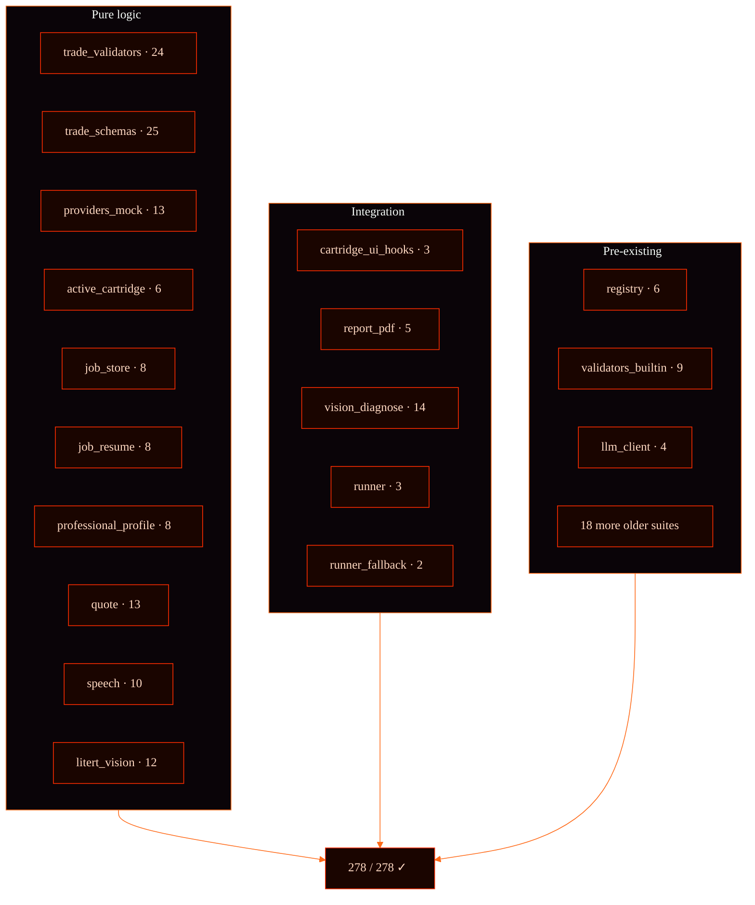

Total: **37 spec files, 278 cases.** New cases this milestone: **150+**
(the trade-app vertical from scratch).

<p align="center">
  
</p>

## ▸ §11 decision log · architecture-level

These are the architectural calls that shaped what's above. CLAUDE.md
§13 has the full list; here are the ones that surface as topology.

| Decision | Why |
|---|---|
| Cartridge model with deterministic validators | The only differentiator after Anthropic + Google shipped Agent Skills (Apr 2026) |
| Provider abstraction (no direct Capacitor in shell) | Future iOS / desktop ports without app rewrite |
| No backend in MVP | PDF + WhatsApp share = full delivery loop, zero infra cost |
| `.py` validators with TS twins | `.py` is reviewable + portable; TS is what runs in-browser |
| ChatMessage.images additive | Cloud + LiteRT + wllama all use the same call site |
| Schema-driven UI (`ui-hints.json` planned) | One form renderer for all cartridges |
| Filesystem for blobs, IndexedDB for refs | IndexedDB quota issues on photos > 50MB; FS is the right primitive |

<p align="center">
  
</p>

## ▸ §12 what's not here yet

- **iOS path** — the LiteRT iOS plugin is a stub. Capacitor camera/share
  work but no on-device vision. Off-roadmap until the SDK lands.
- **Local audio transcription** — speech_recognition plugin only does
  live mic. Pre-recorded audio (voice memos attached to photos) needs
  on-device Whisper or similar; left as future work.
- **Multi-tenant / cloud sync** — the device IS the account (CLAUDE.md
  §3.3). Backup to user's own Google Drive is planned for v1.1.
- **Dataset upload pipeline** — designed in CLAUDE.md §10, schemas
  ready, builds in v1.2.

These are *intentionally* not built yet. The CLAUDE.md §3.3 list is the
authoritative contract on scope.

<p align="center">
  
</p>

<p align="center">
  
</p>

<p align="center">
  <sub><code>// ARCH.MAP // 12 SECTIONS · 9 DIAGRAMS · 278 TESTS</code></sub>
</p>
