# Architecture

> Companion to [`CLAUDE.md`](../CLAUDE.md). The CLAUDE.md is the *contract*
> (what we will and won't build). This file is the *map* (what's wired to
> what, with diagrams).

---

## System overview

skillos_mini is an on-device, mobile-first agentic OS for tradespeople.
The app shell is a Svelte 5 + Capacitor application that orchestrates
domain-specific **cartridges** (sealed bundles of schemas + validators +
prompts + local data) through a **runtime** that runs entirely on the
user's phone.

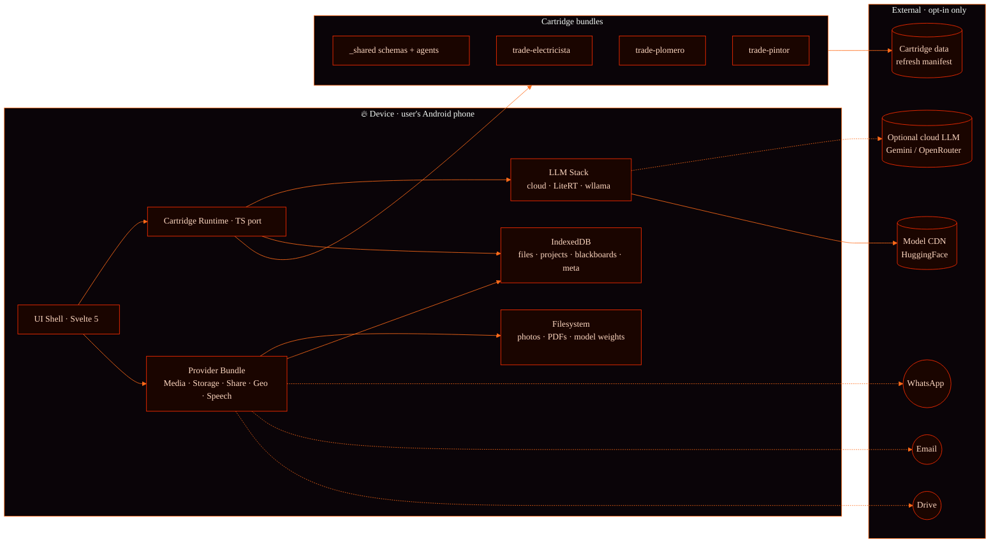

**The dotted lines are user-triggered traffic only.** Per CLAUDE.md §9.3
(privacy invariants), no outbound traffic carries blackboard contents
unless the user has tapped Share, configured a cloud LLM, or (post-v1.2)
opted into dataset contribution.

## The cartridge model

A cartridge is a directory under `cartridges/<name>/` with a fixed shape
the runtime understands. The trade cartridges all follow this layout:

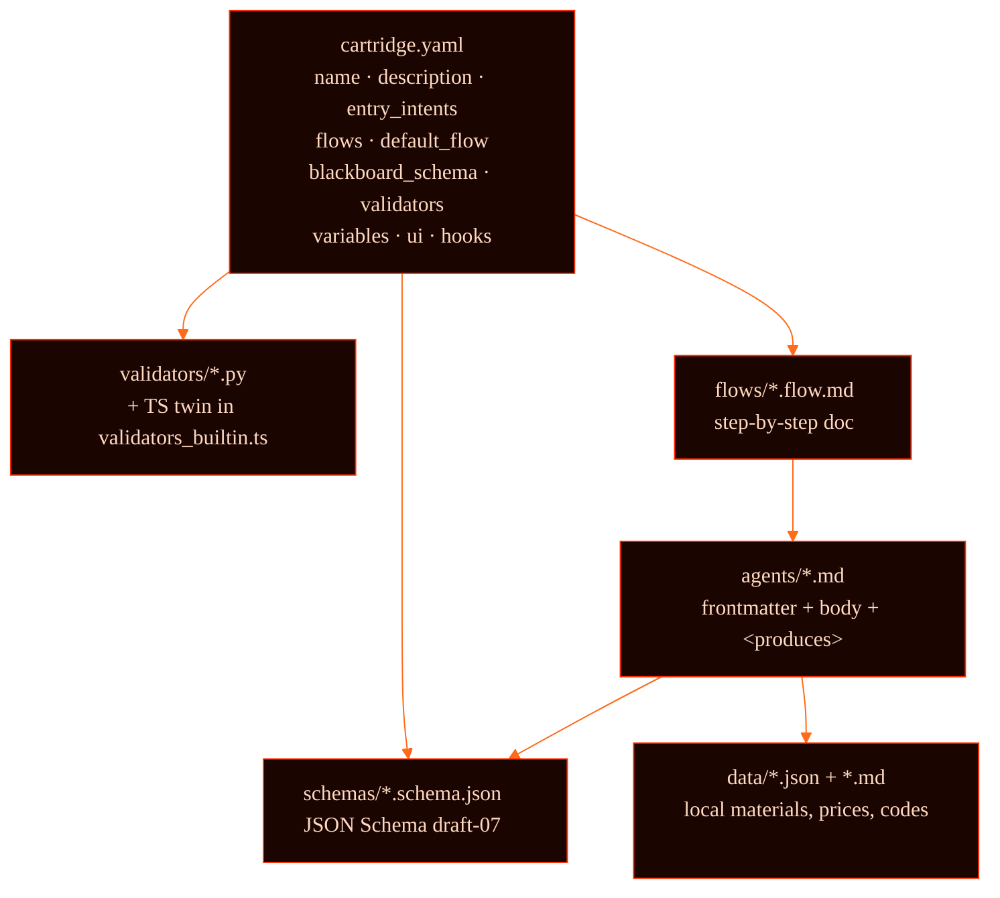

### what `ui:` and `hooks:` add

CLAUDE.md §4.1 introduced two additive optional blocks in
`cartridge.yaml`:

```yaml
ui:
  brand_color: "#2563EB"
  emoji: "⚡"
  primary_action:
    label: "Nuevo trabajo"
    flow: intervention
  secondary_actions:
    - { label: "Sólo presupuestar", flow: quote_only }
  library_default_mode: list   # or "portfolio"

hooks:
  on_quote_generated: [{ send_to_blackboard: client_message }]
  on_job_closed:
    - { generate_report: true }
    - { prompt_corpus_consent: false }
```

The **shell** consumes both. The cartridge knows nothing about Capacitor,
Svelte, or any mobile API — it's a portable bundle of declarative data.

### validators · source-of-truth in code, not prompt

Every regulated check ships as a `.py` file (canonical, reviewable like
any code) + a TS port in `mobile/src/lib/cartridge/validators_builtin.ts`
keyed by filename. The mobile runtime indexes the registry at runtime.

Example — `repair_safety.py` (electricista):


A rule update (e.g. new IEC edition) is a Python diff, not a prompt
rewrite — and it's reviewable like any other code change.

## Layered architecture

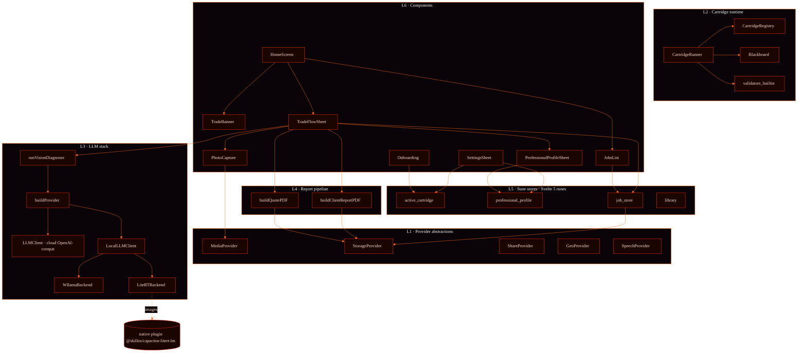

The strict rule (CLAUDE.md §4.3): **layers 2-6 never import `@capacitor/*`
directly.** They go through Layer 1 provider interfaces. The Capacitor
adapter is the *only* Capacitor consumer.

## The trade-app loop

This is the killer flow Daniel (electricista), Mauricio (plomero) and
Verónica (pintora) asked for in the simulated interviews.

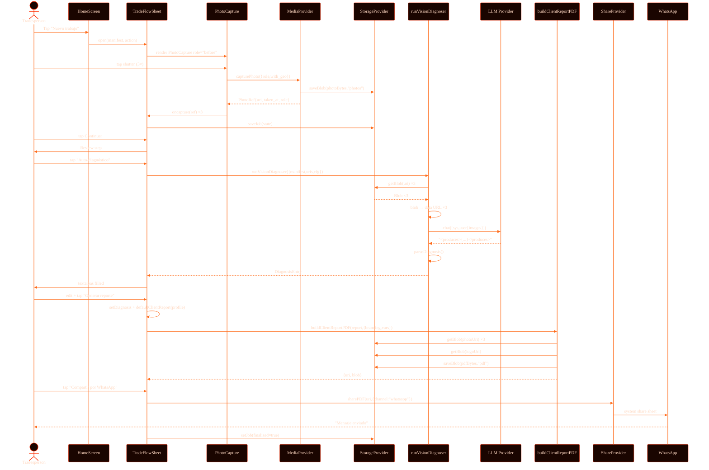

Notes:
- **No backend.** The only outbound traffic is whatever the user sends
  through WhatsApp (their choice) and (optionally) the LLM call to a
  cloud provider they configured per-project.
- **Resumable.** `saveJob` runs at every state change, so dropping the
  app mid-flow and reopening on the Job Library re-enters at the right
  step (`resumeStepFor`).

## The vision pipeline

Two paths share the same call site. Whichever provider the user
configured per-project is what runs.

```mermaid
%%{init: {'theme':'base', 'themeVariables': {'primaryColor':'#1a0500','primaryTextColor':'#ffd9c2','primaryBorderColor':'#ff2d00','lineColor':'#ff6b1a','secondaryColor':'#001a24','tertiaryColor':'#0a0408','background':'#0a0408','mainBkg':'#1a0500','clusterBkg':'#0a0408','edgeLabelBackground':'#0a0408','fontFamily':'ui-monospace, monospace'}}}%%
flowchart LR
    User[User taps Auto-diagnóstico] --> Run[runVisionDiagnoser]
    Run --> Storage[StorageProvider.getBlob]
    Storage --> Encode[Blob → data URL]
    Encode --> Msg["ChatMessage<br/>{role:user,<br/>content,<br/>images: data URL[]}"]
    Msg --> Build[buildProvider]

    Build --> Branch{providerCfg.providerId}
    Branch -- "gemini / openrouter-*" --> CloudPath[LLMClient cloud]
    Branch -- "litert-local" --> LocalPath[LocalLLMClient · LiteRTBackend]
    Branch -- "wllama-local" --> Drop[wllama drops images<br/>warn upstream]

    CloudPath --> Serialize["serializeMessage<br/>content array shape"]
    Serialize --> CloudAPI[("Gemini OpenAI compat<br/>OpenRouter GPT-4V<br/>Claude via OpenRouter")]

    LocalPath --> Strip["extractImagePayloads<br/>strip data: prefix"]
    Strip --> Plugin[("native Android plugin<br/>@skillos/capacitor-litert-lm")]
    Plugin --> Kotlin[LiteRTLMPlugin.kt]
    Kotlin --> SessionAPI["LlmInferenceSession<br/>+ enableVisionModality"]
    SessionAPI --> Bitmap[Base64 → Bitmap → MPImage]
    Bitmap --> Generate[generateResponseAsync]
    Generate --> Tokens[token events]

    CloudAPI --> Parse["parseDiagnosis<br/>tagged · fenced · bare-JSON"]
    Tokens --> Parse
    Parse --> Result[DiagnosisEntry]
```

### what unlocks each path

| Path | Model | Where vision runs | Photos leave the device? |
|---|---|---|---|
| Cloud | Gemini 3.x / GPT-4V / Claude | Provider's GPU | **Yes** (encrypted to provider only) |
| Local | Gemma 4 E2B / E4B (.litertlm) | Phone NPU/GPU/CPU | **No** |
| WASM | wllama (text only) | Phone CPU | N/A — images dropped |

The trade picks per-project (Settings → Provider). The default is **off**
— no cloud LLM auto-runs (CLAUDE.md §12). Gemma 4 local is the privacy-
preserving recommendation; cloud is a fallback for older devices.

## Data flow

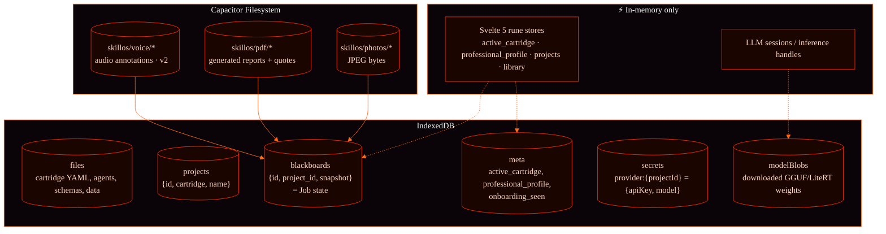

The mapping `Job ↔ BlackboardRecord`:

| JobState field | Snapshot key | Schema |
|---|---|---|
| `photos[]` | `photo_set.photos` | `photo_set.schema.json` |
| `diagnosis` | `diagnosis` | `diagnosis.schema.json` |
| `quote` | `quote` | `quote.schema.json` |
| `client_report` | `client_report` | `client_report.schema.json` |
| `finalized` | `finalized` | bool |
| `updated_at` | `updated_at` | ISO datetime |

Photos are **refs** (`uri: "capacitor-fs://skillos/photos/<id>"`). The
Filesystem is the source of truth for bytes; IndexedDB only stores
references and metadata.

## State machine

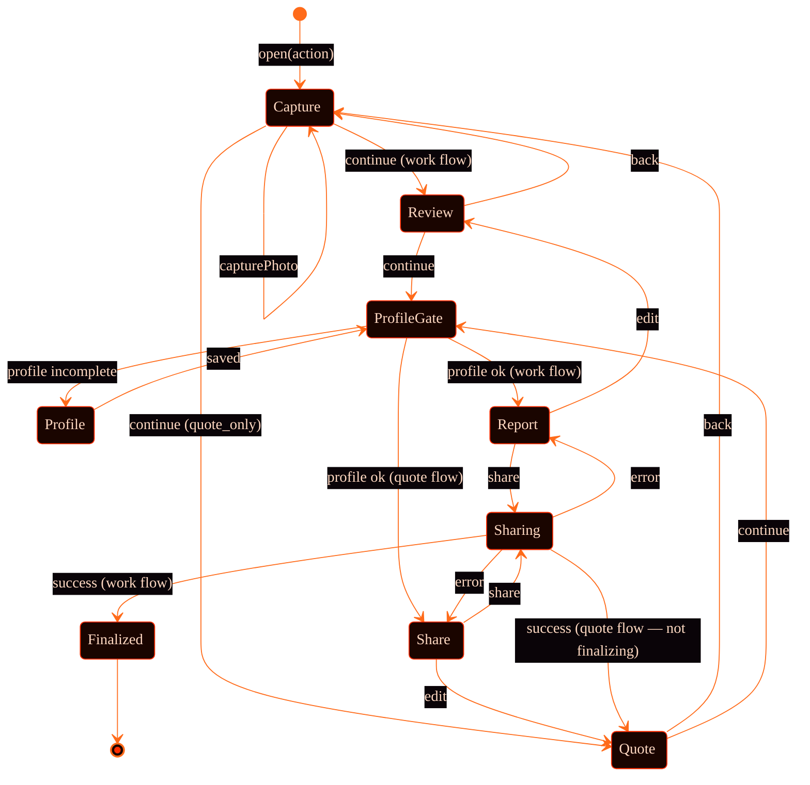

`ProfileGate` is the rule "no PDF until you have a credible footer"
(CLAUDE.md §14 Q3). It opens `ProfessionalProfileSheet` with
`require_complete=true` if `name|business + phone` is missing.

The quote share **does not** finalize — the trade can return later, do
the work, and ship a final report from the same job.

## Build pipeline

### web dev

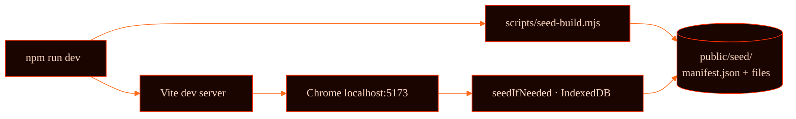

The `seed-build.mjs` script walks `cartridges/` + `system/` + selected
`projects/` and produces `public/seed/manifest.json` + the bundled file
contents. The Vite dev server serves it; `seedIfNeeded()` reads it on
first load and writes everything into IndexedDB so the runtime sees
files-on-disk semantics.

### android apk

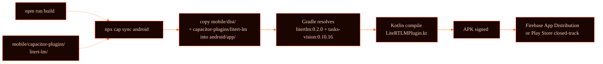

CLAUDE.md §3.3 keeps iOS off the table for now; the iOS plugin is a
stub.

## Cross-cutting invariants

These are CLAUDE.md §9.3 made operational.

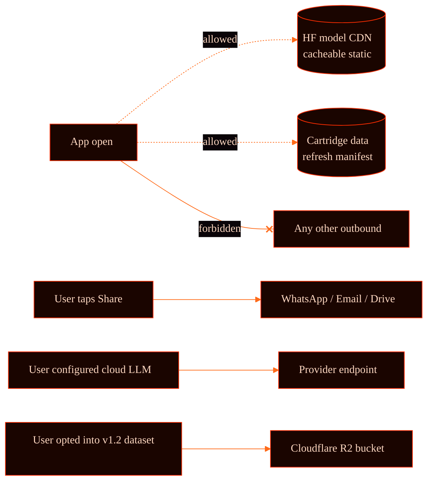

The invariants the test suite enforces:
- `MockShareProvider.shared[]` only fills when explicit `sharePDF` calls
  it.
- `extractImagePayloads()` rejects `http(s)` URLs (privacy gate when the
  cloud serializer encounters a remote URL).
- `professional_profile.svelte.ts` normalizes/trims so empty fields
  never leak into a PDF footer the user never reviewed.

## Test coverage map

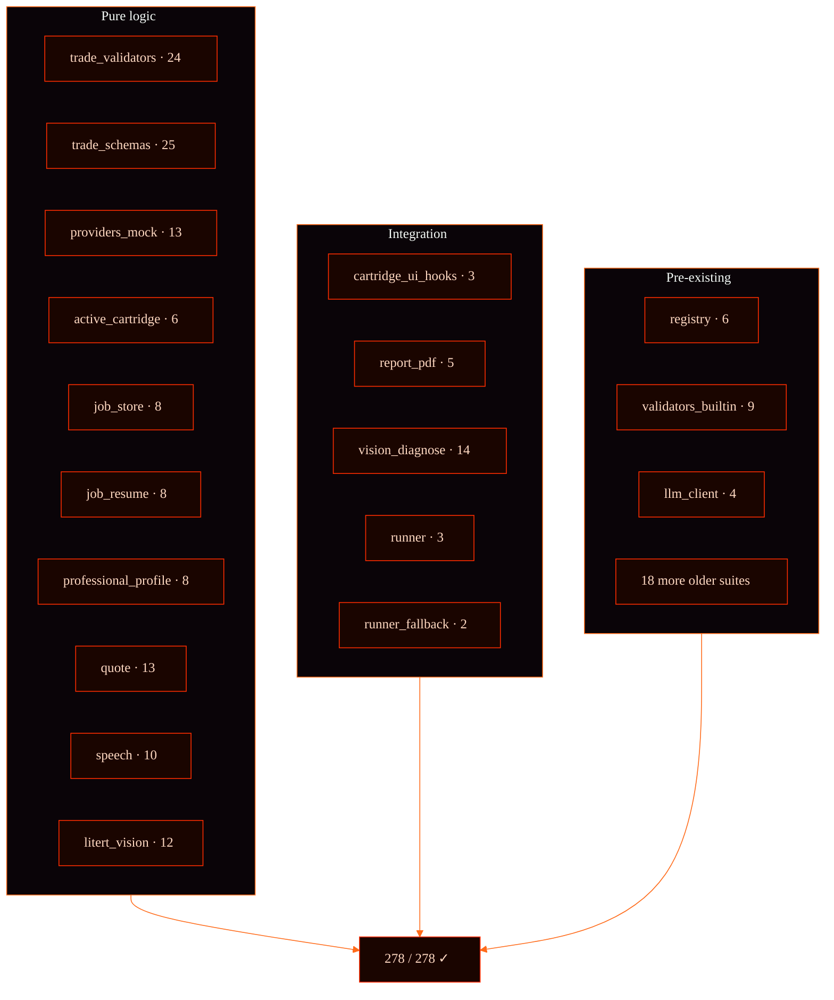

Total: **37 spec files, 278 cases.** New cases this milestone: **150+**
(the trade-app vertical from scratch).

## Cartridge v2 runtime

The v2 cartridge runtime replaces v1's linear agent pipeline with a
**document-tree navigator** + **shared TS tool library** + **hybrid LLM agency**.

```
┌──────────────────────────────────────────────────────────┐
│ UI Layer (Svelte 5)   ← Unchanged screens               │
├──────────────────────────────────────────────────────────┤
│ Navigator (TS)        ← State machine: walk + hybrid     │
├──────────────────────────────────────────────────────────┤
│ LLM (Gemma 4 E2B)    ← Route, pick-next, tool-call, compose │
├──────────────────────────────────────────────────────────┤
│ Tool Library (TS)     ← Deterministic: electrical, safety, pricing │
└──────────────────────────────────────────────────────────┘
```

### Key design: hybrid tool-calling

The Navigator combines **deterministic** and **adaptive** execution:

1. **Mandatory tools** — `tool-call` blocks in markdown are pre-parsed and
   executed without LLM involvement. These enforce regulations (IEC 60364
   wire checks, RCD requirements, etc.).

2. **Adaptive tools** — `available-tools` blocks declare a whitelist. After
   mandatory tools run, the LLM sees the results and may invoke additional
   tools from that whitelist. The document prose guides the LLM's decisions.

3. **Composing** — after the walk completes, the LLM synthesizes a final
   artifact (diagnosis, quote, report) from all accumulated tool results.

This hybrid approach lets a 2B-4B model do useful reasoning (which checks
to run, how to phrase the output) while all computation and compliance
logic remains in deterministic TypeScript.

### Navigator state machine

```
IDLE → LOADING → ROUTING → WALKING → COMPOSING → DONE
         │           │         │          │
         │           │         │          └─ LLM synthesizes artifact
         │           │         └─ Per doc:
         │           │              1. Mandatory tool-calls (deterministic)
         │           │              2. Hybrid tool loop (LLM + whitelist)
         │           │              3. LLM picks next doc or DONE
         │           └─ LLM matches user intent to entry doc
         └─ Load MANIFEST, verify tools, build index
```

### Per-document execution flow (WALKING phase)

```
┌─ Parse doc ──────────────────────────────────────────────┐
│  md_walker → frontmatter + prose + tool-calls            │
│              + available-tools + cross-refs               │
├─ Execute mandatory tools ────────────────────────────────┤
│  For each tool-call block:                               │
│    arg_resolver resolves ${ctx.X} from blackboard        │
│    tool_invoker dispatches to TS function                │
│    Result → blackboard + walk log                        │
├─ Hybrid tool loop (if available-tools declared) ─────────┤
│  System: "You have these tools: [...]. Use <tool_call>." │
│  Loop (max N turns):                                     │
│    LLM response → parse for <tool_call> tags             │
│    Whitelist check → registry check → execute            │
│    Result → blackboard + context for next turn           │
│    If LLM says DONE → exit loop                          │
├─ Pick next ──────────────────────────────────────────────┤
│  context_compactor builds prompt (budget: 3000 chars)    │
│  LLM picks next cross-ref doc ID or says DONE            │
└──────────────────────────────────────────────────────────┘
```

### Guardrails (5 layers)

| Layer | What | How |
|-------|------|-----|
| Manifest | `tools_required` + `tools_optional` | Cartridge-level tool declaration |
| Doc whitelist | `available-tools` block per doc | LLM can only call listed tools |
| Registry check | `registry.has(toolName)` | Prevents hallucinated tool names |
| Call ceiling | `max_calls` (default 3) per doc | Prevents runaway loops |
| Arg validation | Tool functions validate their own args | Type-level + runtime checks |

### Why this works with Gemma 4 (2B-4B parameters)

The Navigator minimizes what the LLM needs to do:

| LLM task | Input | Output | Budget |
|----------|-------|--------|--------|
| Routing | User task + 3-5 route options | Single doc ID | ~20 tokens |
| Pick next | Context summary + 2-5 options | Single doc ID or "DONE" | ~20 tokens |
| Hybrid tool call | Results + tool list + doc prose | `<tool_call name="x">{args}</tool_call>` | ~50 tokens |
| Composing | All results + blackboard | Spanish prose report | ~200 tokens |

Context compaction (`context_compactor.ts`) keeps the prompt under 3000
characters for navigation turns and 4000 for composing. This fits
comfortably in Gemma 4's context window.

The document prose acts as **in-context few-shot** — the LLM reads the
markdown text (which explains the domain) and uses it to make better
decisions about which tools to call and what to say.

### v2 module map (`src/lib/cartridge-v2/`)

| Module | Responsibility |
|--------|---------------|
| `types.ts` | NavState, phases, events, AvailableToolsBlock, blackboard types |
| `md_walker.ts` | Parse .md → frontmatter + tool-calls + available-tools + prose + cross-refs |
| `arg_resolver.ts` | Resolve `${ctx.X}` and `${tool_results.last.Y}` expressions |
| `blackboard.ts` | Typed session KV store with source tracking |
| `tool_invoker.ts` | Registry + dispatch for dotted tool names |
| `frontmatter_index.ts` | Lightweight index of all cartridge docs |
| `cartridge_loader.ts` | Loads MANIFEST.md, verifies tools, builds data accessor |
| `navigator.ts` | State machine + hybrid tool loop + composing |
| `context_compactor.ts` | Context assembly for nav, hybrid, and composing turns |
| `trace_emitter.ts` | Session trace serialization (YAML+md for dream consolidation) |
| `ui_compat.ts` | Legacy CartridgeManifest shim for existing Svelte components |
| `llm_adapter.ts` | Bridges LLMProvider → Navigator's InferenceFn (configurable token budget) |

### Tool library (`src/lib/tool-library/`)

Shared deterministic tools. The LLM never implements these — it only invokes them:

| Module | Tools |
|--------|-------|
| `electrical.ts` | checkWireGauge, checkRCDRequired, maxLoadForSection, computeBreakerMargin |
| `safety.ts` | classify, combineHazards |
| `pricing.ts` | lineItemTotal, applyTax, formatQuote |
| `units.ts` | formatCurrency |
| `plumbing.ts` | Plumbing diagnostics |
| `painting.ts` | Surface area, paint coverage |
| `pdf.ts` | renderQuote, renderReport |
| `share.ts` | toWhatsApp |

### v2 cartridge format

A v2 cartridge is a directory with:
- `MANIFEST.md` — YAML frontmatter (id, tools_required, locale, navigation, produces)
- `*.md` docs — each with frontmatter + tool-call blocks + available-tools + prose + cross-refs
- `data/*.json` — local materials/prices

Three block types in document bodies:

````markdown
# Mandatory tool-call (always executes, no LLM)
```tool-call
tool: electrical.checkWireGauge
args:
  breaker_amps: ${ctx.breaker_amps}
  wire_section_mm2: ${ctx.wire_section_mm2}
```

# Available tools (LLM may call these adaptively)
```available-tools
tools:
  - electrical.checkCircuitBreaker
  - safety.checkRCD
max_calls: 3
purpose: "Additional checks based on symptoms"
```

# Cross-refs (LLM picks which to visit next)
[Presupuesto recableado](#presupuesto)
[Sin RCD](#sin_rcd)
````

### Didactic example: complete walk

User says: "tengo un cable que se calienta mucho en la cocina"

```
1. LOADING
   Navigator reads MANIFEST.md → cartridge "electricista"
   Verifies tools: electrical.checkWireGauge ✓, safety.checkRCD ✓

2. ROUTING
   LLM sees routes: "cable problem → diagnosis", "no RCD → sin_rcd"
   LLM picks: "diagnosis" (matches "cable se calienta")

3. WALKING — doc: diagnosis.md
   Mandatory: electrical.checkWireGauge(breaker=32, wire=2.5, length=12)
     → Result: { verdict: "fail", reason: "2.5mm² insufficient for 32A" }

   Available-tools: [electrical.checkCircuitBreaker, safety.checkRCD]
   LLM sees the "fail" verdict + doc prose about additional checks
   LLM calls: <tool_call name="safety.checkRCD">{"has_rcd": "false"}</tool_call>
     → Result: { verdict: "fail", reason: "No RCD installed" }
   LLM says: DONE

   Cross-refs: [#presupuesto]
   LLM picks: "presupuesto"

4. WALKING — doc: presupuesto.md
   Mandatory: pricing.lineItemTotal(cable_4mm2, 12m, ...)
     → Result: { subtotal: 3200, tax: 704, total: 3904 }
   No available-tools, no cross-refs → terminal

5. COMPOSING
   LLM receives: all tool results + blackboard + walk log
   LLM produces: "DIAGNÓSTICO: Cable 2.5mm² alimentando térmico 32A en
   cocina — subdimensionado (IEC 60364-5-52). Sin diferencial. PROPUESTA:
   Recableado con 4mm² + instalación RCD 30mA. Total: $3904 + IVA."

6. DONE
   Artifact stored on blackboard as _artifact
   UI renders the diagnosis to the user
```

---

## Decision log

These are the architectural calls that shaped what's above. CLAUDE.md
§13 has the full list; here are the ones that surface as topology.

| Decision | Why |
|---|---|
| Cartridge model with deterministic validators | The only differentiator after Anthropic + Google shipped Agent Skills (Apr 2026) |
| Provider abstraction (no direct Capacitor in shell) | Future iOS / desktop ports without app rewrite |
| No backend in MVP | PDF + WhatsApp share = full delivery loop, zero infra cost |
| `.py` validators with TS twins | `.py` is reviewable + portable; TS is what runs in-browser |
| ChatMessage.images additive | Cloud + LiteRT + wllama all use the same call site |
| Schema-driven UI (`ui-hints.json` planned) | One form renderer for all cartridges |
| Filesystem for blobs, IndexedDB for refs | IndexedDB quota issues on photos > 50MB; FS is the right primitive |

## What's not here yet

- **iOS path** — the LiteRT iOS plugin is a stub. Capacitor camera/share
  work but no on-device vision. Off-roadmap until the SDK lands.
- **Local audio transcription** — speech_recognition plugin only does
  live mic. Pre-recorded audio (voice memos attached to photos) needs
  on-device Whisper or similar; left as future work.
- **Multi-tenant / cloud sync** — the device IS the account (CLAUDE.md
  §3.3). Backup to user's own Google Drive is planned for v1.1.
- **Dataset upload pipeline** — designed in CLAUDE.md §10, schemas
  ready, builds in v1.2.

These are *intentionally* not built yet. The CLAUDE.md §3.3 list is the
authoritative contract on scope.

