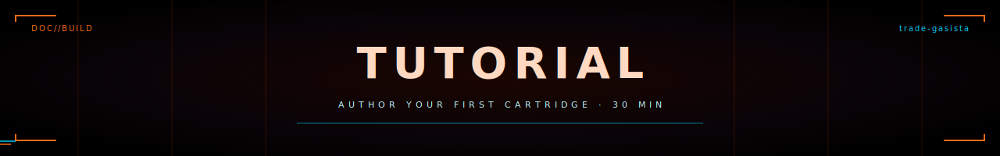

<p align="center">
  
</p>

<p align="center">
  <strong>Tutorial</strong> &nbsp;//&nbsp; build your own trade cartridge &nbsp;//&nbsp; <code>trade-gasista</code>
</p>

<p align="center">
  
</p>

> 30-minute walkthrough. By the end you'll have a working `trade-gasista`
> cartridge running in skillos_mini, complete with vision diagnosis,
> deterministic safety validators, branded PDF output, and a place in the
> Home screen's trade picker.

We'll model a **gasista** (gas-installation tradesperson) as our worked
example. The same recipe applies to any vertical — herrero, carpintero,
jardinero, mecánico, vet móvil, equipos médicos field service, anything
that fits the "go onsite, photograph, diagnose, propose, execute,
deliver a PDF" loop.

---

## ▸ §0 prerequisites

```bash
# You should already have skillos_mini running locally.
cd skillos_mini/mobile
npm install
npm test                 # confirm 278 / 278 passing
npm run check            # confirm 0 errors
```

Read the [`CLAUDE.md`](../CLAUDE.md) source-of-truth guide first
(especially §4 architectural principles and §6 cartridge spec) — it
defines the rules this tutorial respects.

---

<p align="center">
  
</p>

## ▸ §1 create the directory structure

Cartridges live under `cartridges/<name>/`. The runtime indexes them by
listing every `cartridges/<name>/cartridge.yaml` file at boot.

```bash
cd skillos_mini
mkdir -p cartridges/trade-gasista/{agents,flows,schemas,validators,data}
```

The full layout we'll fill in:

```
cartridges/trade-gasista/
├── cartridge.yaml          # manifest with ui: + hooks:
├── flows/
│   └── intervention.flow.md
├── agents/
│   ├── vision-diagnoser.md
│   ├── quote-builder.md
│   └── report-composer.md
├── schemas/                # copies of _shared/schemas + cartridge-specific
│   └── *.schema.json
├── validators/
│   └── gas_safety.py
└── data/
    ├── materials_uy.json
    ├── labor_rates_uy.json
    ├── problem_codes.md
    └── gas_norms.md
```

---

<p align="center">
  
</p>

## ▸ §2 write the manifest · `cartridge.yaml`

This is the central declaration. It tells the runtime what flows exist,
what the blackboard schema is, what validators run, and how the shell
should brand itself when this cartridge is active.

```yaml
# cartridges/trade-gasista/cartridge.yaml
name: trade-gasista
description: >
  Cartridge para gasistas matriculados en Uruguay. Inspección visual de
  instalaciones, detección de fugas, presupuesto, reporte. Validador
  deterministico aplica MIEM-DNETN (subset).

category: trade
tags: [trade, gasista, residential, on-device]

entry_intents:
  - gasista
  - olor a gas
  - revisar instalación de gas
  - presupuesto gasista
  - fuga de gas

flows:
  intervention:
    - vision-diagnoser
    - quote-builder
    - report-composer
  quote_only:
    - vision-diagnoser
    - quote-builder

default_flow: intervention

blackboard_schema:
  photo_set:        photo_set.schema.json
  diagnosis:        diagnosis.schema.json
  work_plan:        work_plan.schema.json
  quote:            quote.schema.json
  execution_trace:  execution_trace.schema.json
  client_report:    client_report.schema.json

validators:
  - gas_safety.py

max_turns_per_agent: 3
preferred_tier: local

variables:
  currency: UYU
  tax_rate: 0.22
  region: Uruguay
  dialect: rioplatense
  warranty_default: >
    Garantía de 6 meses sobre la mano de obra y los repuestos colocados.
    No cubre fallas en cañerías, artefactos o conexiones preexistentes
    ajenas a la intervención documentada.
  professional_disclaimer: >
    Trabajo realizado por gasista matriculado MIEM-DNETN actuante. Esta
    aplicación asiste con documentación; no sustituye juicio profesional
    ni inspección oficial cuando corresponda.

ui:
  brand_color: "#EA580C"
  accent_color: "#9A3412"
  emoji: "🔥"
  primary_action:
    label: "Nuevo trabajo"
    flow: intervention
    icon: bolt
  secondary_actions:
    - label: "Sólo presupuestar"
      flow: quote_only
      icon: clipboard
  library_default_mode: list

hooks:
  on_quote_generated:
    - send_to_blackboard: client_message
  on_job_closed:
    - generate_report: true
    - prompt_corpus_consent: false
```

### Anatomy

- **`flows`** — named sequences of agents. `intervention` is the full
  loop; `quote_only` skips execution + report.
- **`blackboard_schema`** — every key the runtime might write, mapped to
  a JSON Schema file in `schemas/`.
- **`validators`** — list of `.py` filenames. The mobile runtime looks
  them up in `validators_builtin.ts` (next step).
- **`variables`** — substituted into agent prompts and PDF templates.
- **`ui:` and `hooks:`** — the trade-shell config. `brand_color` drives
  the banner, the emoji shows in the chip, `primary_action` is the big
  CTA on Home.

---

<p align="center">
  
</p>

## ▸ §3 copy the shared schemas

Until the runtime supports cross-cartridge schema refs, each cartridge
ships its own copy. We copy from `_shared/schemas/`:

```bash
cp cartridges/_shared/schemas/*.schema.json cartridges/trade-gasista/schemas/
```

You don't need to author these — `_shared/` already covers
`photo_set`, `diagnosis`, `work_plan`, `quote`, `execution_trace`,
`client_report`, `client_message`. Cartridge-specific extra schemas can
be added later if your flow produces something exotic (most don't).

---

<p align="center">
  
</p>

## ▸ §4 write the agent prompts

Three agents drive the flow: vision-diagnoser, quote-builder,
report-composer.

### `agents/vision-diagnoser.md`

```markdown
---
name: vision-diagnoser
description: Diagnose a gas installation problem from photos.
needs: [photo_set]
produces: [diagnosis]
produces_schema: diagnosis.schema.json
produces_description: >
  Diagnosis with severity 1-5, gas-specific problem_categories
  (see data/problem_codes.md), hazards, and client_explanation.
max_turns: 2
tier: capable
---

# Vision Diagnoser — Gasista

Sos gasista matriculado MIEM-DNETN con 15+ años de experiencia
residencial en Uruguay. Te llegaron 1 a 5 fotos de un problema de gas.

## Lo que hacés

1. Mirá cada foto. Identificá: tipo de instalación (calefón / cocina /
   cañería / regulador / medidor), antigüedad aparente, signos visibles
   de falla (corrosión, conexiones flojas, mangueras vencidas, falta de
   ventilación, instalación clandestina).

2. Asigná uno o más `problem_categories` desde `data/problem_codes.md`.

3. **Severidad 1-5**: 1=cosmético / 5=peligro inmediato (riesgo de fuga
   activa o intoxicación CO).

4. `summary` técnico (1 párrafo).

5. `client_explanation` llano (2-3 oraciones, sin jerga).

6. Marcá CADA peligro visible en `hazards` aunque el cliente no lo
   haya mencionado.

## Lo que NO hacés

- No proponés cómo arreglarlo (lo hace `quote-builder`).
- No inventás detalles que no se ven.
- No emitís JSON fuera del bloque `<produces>`.
- Si hay fuga activa visible o sospecha de CO, severity = 5 y el primer
  hazard es `requires_immediate_action: true`.

## Output

<produces>
{
  "diagnosis": {
    "trade": "gasista",
    "severity": 4,
    "problem_categories": ["regulador_envejecido", "ventilacion_insuficiente"],
    "summary": "Regulador de garrafa con corrosión visible y fecha de fabricación 2014. Ambiente de calefón sin rejilla de ventilación inferior obligatoria.",
    "client_explanation": "El regulador de la garrafa está vencido — los reguladores se cambian cada 5 años y este es de 2014. Además el calefón está en un cuarto sin la rejilla de ventilación que la norma exige.",
    "visual_evidence_refs": ["..."],
    "hazards": [
      { "kind": "fire", "description": "Regulador envejecido — riesgo de fuga.", "requires_immediate_action": false },
      { "kind": "intoxicacion_co", "description": "Falta ventilación inferior en ambiente con calefón a gas.", "requires_immediate_action": true }
    ],
    "confidence": 0.78
  }
}
</produces>
```

> **Tip**: copy the structure from `cartridges/trade-electricista/agents/vision-diagnoser.md`
> — same shape, just swap the trade vocabulary and reference table.

### `agents/quote-builder.md` and `agents/report-composer.md`

Same pattern. Copy from `_shared/agents/` and customize.

For `quote-builder.md`, key trade-specific gates to mention:

> Para steps que toquen cañería de gas: `safety_preconditions:
> ["gas_main_closed", "leak_test_documented"]`. El validador
> `gas_safety.py` rechaza el output si falta.

---

<p align="center">
  
</p>

## ▸ §5 write the deterministic validator

This is **the differentiator**. The agent prompt suggests; the validator
enforces. Validators are `.py` (canonical, reviewable) + a TS port.

### Python source: `validators/gas_safety.py`

```python
"""Gas-installation safety validator. Pure-Python source of truth.

Rules:
  GS1  Steps that work on gas piping must list `gas_main_closed`.
  GS2  Cooktop / hob / calefón work in enclosed rooms must include a
       step verifying ventilation per MIEM-DNETN.
  GS3  Any work_plan touching the meter or main line MUST set
       `requires_matriculated_professional: true`.
  GS4  Leak test must be documented before the trade closes the job
       — execution_trace must contain a "prueba de fuga" note.
"""

from __future__ import annotations

GAS_PIPING_KEYWORDS = ("cañeria", "caneria", "manguera", "regulador", "valvula")
ENCLOSED_ROOMS = {"baño", "bano", "cocina_cerrada", "lavadero"}
METER_KEYWORDS = ("medidor", "tronco principal", "regulador troncal")


def _deaccent(s: str) -> str:
    import unicodedata
    return "".join(
        c for c in unicodedata.normalize("NFD", s.lower())
        if unicodedata.category(c) != "Mn"
    )


def validate(blackboard: dict) -> tuple[bool, str]:
    wp_entry = blackboard.get("work_plan")
    if not wp_entry:
        return True, "skipped (no work_plan yet)"
    wp = wp_entry.get("value", {})
    steps = wp.get("steps") or []

    problems = []

    # GS1
    for s in steps:
        desc = _deaccent(s.get("description") or "")
        preconds = set(s.get("safety_preconditions") or [])
        if any(k in desc for k in GAS_PIPING_KEYWORDS):
            if "gas_main_closed" not in preconds:
                problems.append(f"{s.get('id','?')}: gas-piping step missing gas_main_closed precondition")

    # GS3
    needs_matric = any(
        any(k in _deaccent(s.get("description") or "") for k in METER_KEYWORDS)
        for s in steps
    )
    if needs_matric and not wp.get("requires_matriculated_professional"):
        problems.append("work_plan touches meter/main line but requires_matriculated_professional is not true")

    # GS4 — only enforced when execution_trace is present
    et_entry = blackboard.get("execution_trace")
    if et_entry:
        actions = et_entry.get("value", {}).get("actions") or []
        has_leak_test = any(
            "prueba de fuga" in _deaccent(a.get("notes") or "")
            for a in actions
        )
        if actions and not has_leak_test:
            problems.append("execution_trace closes without documenting prueba de fuga")

    if problems:
        return False, "gas safety violations: " + "; ".join(problems)
    return True, f"gas safety ok ({len(steps)} steps)"
```

### TS port in `mobile/src/lib/cartridge/validators_builtin.ts`

The mobile runtime can't run `.py` directly. We add a TS twin keyed by
the filename. Open `mobile/src/lib/cartridge/validators_builtin.ts` and
add:

```typescript
// At the bottom, before the BUILTIN_VALIDATORS map:

const GAS_PIPING_KEYWORDS = ["caneria", "manguera", "regulador", "valvula"];
const METER_KEYWORDS = ["medidor", "tronco principal", "regulador troncal"];

const gasSafety: BuiltinValidator = (bb) => {
  const wpEntry = bb.work_plan;
  if (!wpEntry) return { ok: true, message: "skipped (no work_plan yet)" };
  const wp = isObject(wpEntry.value) ? wpEntry.value : {};
  const steps = Array.isArray(wp.steps) ? (wp.steps as Record<string, unknown>[]) : [];

  const problems: string[] = [];

  // GS1
  for (const s of steps) {
    if (!isObject(s)) continue;
    const desc = deaccent(String(s.description ?? ""));
    const preconds = new Set(asStringArrayLite(s.safety_preconditions));
    if (GAS_PIPING_KEYWORDS.some((k) => desc.includes(k))) {
      if (!preconds.has("gas_main_closed")) {
        problems.push(`${String(s.id ?? "?")}: gas-piping step missing gas_main_closed precondition`);
      }
    }
  }

  // GS3
  const needsMatric = steps.some((s) =>
    isObject(s) &&
    METER_KEYWORDS.some((k) => deaccent(String(s.description ?? "")).includes(k)),
  );
  if (needsMatric && wp.requires_matriculated_professional !== true) {
    problems.push("work_plan touches meter/main line but requires_matriculated_professional is not true");
  }

  // GS4
  const etEntry = bb.execution_trace;
  if (etEntry && isObject(etEntry.value)) {
    const actions = Array.isArray(etEntry.value.actions) ? (etEntry.value.actions as Record<string, unknown>[]) : [];
    const hasLeakTest = actions.some((a) =>
      isObject(a) && deaccent(String(a.notes ?? "")).includes("prueba de fuga"),
    );
    if (actions.length > 0 && !hasLeakTest) {
      problems.push("execution_trace closes without documenting prueba de fuga");
    }
  }

  if (problems.length > 0) {
    return { ok: false, message: "gas safety violations: " + problems.join("; ") };
  }
  return { ok: true, message: `gas safety ok (${steps.length} steps)` };
};

// Register in the BUILTIN_VALIDATORS map at the bottom of the file:
//   "gas_safety.py": gasSafety,
//   "gas_safety.ts": gasSafety,
```

The TS twin uses `deaccent`, `isObject`, and `asStringArrayLite` — all
already exported helpers in `validators_builtin.ts`.

---

<p align="center">
  
</p>

## ▸ §6 write a test

Open `mobile/tests/trade_validators.spec.ts` (or create a new
`gas_validator.spec.ts` — same pattern). Add **at least 3 pass + 3 fail
cases** per CLAUDE.md §9.2:

```typescript
import { describe, expect, it } from "vitest";
import { BUILTIN_VALIDATORS } from "../src/lib/cartridge/validators_builtin";
import type { BlackboardSnapshot } from "../src/lib/cartridge/types";

function entry(value: unknown) {
  return { value, schema_ref: "x.json", produced_by: "test", description: "", created_at: "2026-04-25T00:00:00Z" };
}

describe("gas_safety validator", () => {
  const v = BUILTIN_VALIDATORS["gas_safety.py"];

  it("skips without work_plan", () => {
    expect(v({}).ok).toBe(true);
  });

  it("passes a clean piping job with gas_main_closed", () => {
    const bb: BlackboardSnapshot = {
      work_plan: entry({
        steps: [
          { id: "S1", description: "Reemplazar manguera del calefón", safety_preconditions: ["gas_main_closed"] },
        ],
        requires_matriculated_professional: true,
      }),
    };
    expect(v(bb).ok).toBe(true);
  });

  it("passes meter work when matriculation declared", () => {
    const bb: BlackboardSnapshot = {
      work_plan: entry({
        steps: [{ id: "S1", description: "Inspección del medidor de gas", safety_preconditions: ["gas_main_closed"] }],
        requires_matriculated_professional: true,
      }),
    };
    expect(v(bb).ok).toBe(true);
  });

  it("fails when piping step lacks gas_main_closed", () => {
    const bb: BlackboardSnapshot = {
      work_plan: entry({
        steps: [{ id: "S1", description: "Cambio de cañería de la cocina" }],
      }),
    };
    const r = v(bb);
    expect(r.ok).toBe(false);
    expect(r.message).toMatch(/gas_main_closed/);
  });

  it("fails meter work without requires_matriculated_professional", () => {
    const bb: BlackboardSnapshot = {
      work_plan: entry({
        steps: [{ id: "S1", description: "Reemplazo del medidor", safety_preconditions: ["gas_main_closed"] }],
        requires_matriculated_professional: false,
      }),
    };
    expect(v(bb).ok).toBe(false);
  });

  it("fails when execution_trace closes without prueba de fuga", () => {
    const bb: BlackboardSnapshot = {
      work_plan: entry({
        steps: [{ id: "S1", description: "Reemplazo de manguera", safety_preconditions: ["gas_main_closed"] }],
      }),
      execution_trace: entry({
        actions: [
          { step_ref: "S1", started_at: "2026-04-25T10:00:00Z", outcome: "completed", notes: "Manguera cambiada" },
        ],
      }),
    };
    const r = v(bb);
    expect(r.ok).toBe(false);
    expect(r.message).toMatch(/prueba de fuga/);
  });
});
```

Run:

```bash
cd mobile && npm test -- tests/trade_validators.spec.ts
# → all green
```

---

<p align="center">
  
</p>

## ▸ §7 add the local data files

These files are the *cartridge's worldview*. They drive prompt
substitution, materials lists, problem code vocabularies, regulatory
references — none of it lives in the agent prompt itself.

### `data/materials_uy.json`

```json
{
  "$comment": "Reference prices in UYU as of 2026-04. Validate with gasista advisor before production.",
  "currency": "UYU",
  "updated_at": "2026-04-25",
  "materials": [
    { "sku": "REG-MOLA",  "brand": "Mola",     "name": "Regulador de baja presión 1.4 kg/h", "unit": "u",     "unit_price": 1850 },
    { "sku": "MAN-FL-50", "brand": "Mola",     "name": "Manguera flexible inox 50cm",         "unit": "u",     "unit_price": 980 },
    { "sku": "VAL-3/8",   "brand": "FV",       "name": "Llave de paso para gas 3/8\"",         "unit": "u",     "unit_price": 1450 },
    { "sku": "CAL-EM",    "brand": "Eskabe",   "name": "Calefón mural 13 lts/min gas natural", "unit": "u",     "unit_price": 12500 },
    { "sku": "DETEC-GAS", "brand": "Spectrum", "name": "Detector de gas con alarma 220V",      "unit": "u",     "unit_price": 3200 }
  ]
}
```

### `data/labor_rates_uy.json`

Same shape as electricista — `kind`, `description`, `hourly`. Different
tiers (matriculado, ayudante, urgencia).

### `data/problem_codes.md`

The vocabulary the agent must use. Same format as
`trade-electricista/data/problem_codes.md`. Include codes like
`regulador_envejecido`, `manguera_vencida`, `ventilacion_insuficiente`,
`fuga_activa`, `instalacion_clandestina`, `medidor_obsoleto`,
`conexion_floja_gas`, etc.

### `data/gas_norms.md`

Reference — what does each rule actually map to in MIEM-DNETN?

---

<p align="center">
  
</p>

## ▸ §8 reseed and test in the dev server

```bash
cd mobile
npm run seed       # Walk cartridges/, build public/seed/manifest.json
npm run dev        # Vite at localhost:5173
```

Open Chrome, hit `localhost:5173`. The Onboarding flow now offers
**Gasista** in the trade picker (because your cartridge has `ui:`).

- Pick Gasista → Home shows the orange banner with "🔥 Gasista" chip.
- Tap "Nuevo trabajo" → camera opens.
- Take 1-2 photos (browser will use Web file picker).
- Continue → diagnosis textareas.
- If you have a Gemini API key configured in Settings, tap
  "✨ Auto-diagnóstico" — Gemini will return a JSON-shaped diagnosis
  parsed by `runVisionDiagnoser`.
- Generate report → PDF appears with your branding.
- Share → browser download fallback (Web mode).

If you have an Android device set up:

```bash
npx cap sync android
npx cap open android
# Build + run on device. WhatsApp share works for real now.
```

---

<p align="center">
  
</p>

## ▸ §9 validate the cartridge in the runtime

Beyond your unit test for the validator, the runtime has integration
hooks. The fastest end-to-end loop:

```bash
cd mobile
npm test -- tests/cartridge_ui_hooks.spec.ts
npm test -- tests/registry.spec.ts
npm run check
```

If `cartridge_ui_hooks` parses your `ui:` and `hooks:` blocks correctly,
and `registry` lists your cartridge in the `loadAll` test, you're good.

---

<p align="center">
  
</p>

## ▸ §10 commit

```bash
git add cartridges/trade-gasista \
        mobile/src/lib/cartridge/validators_builtin.ts \
        mobile/tests/trade_validators.spec.ts
git commit -m "feat: trade-gasista cartridge — gas-installation safety validator + flow"
```

Per CLAUDE.md §8.1 every PR must:

- ✅ pass `npm run check`
- ✅ pass `npm test`
- ✅ add tests for any new validator (≥6 fixtures)
- ❌ not add new top-level `package.json` deps (you didn't — good)

---

<p align="center">
  
</p>

## ▸ §11 optional · cartridge data refresh

Once you've published your cartridge, you can let users get updated
material prices and brand catalogs **without releasing a new APK**.

The cartridge declares a refresh URL in `cartridge.yaml`:

```yaml
data_refresh_url: https://your-org.github.io/skillos-cartridges/gasista/manifest.json
```

The app, on startup with WiFi, fetches that manifest and updates any
`data/*.json` files that have a newer `updated_at`. No backend, just
GitHub Pages or Cloudflare Pages serving static JSON.

> **Q2 of CLAUDE.md §14** is still open: the canonical URL convention
> hasn't been locked. Watch that issue or check Settings → Cartridge
> data once it lands.

---

<p align="center">
  
</p>

## ▸ §12 what you've just built

You added **a new trade vertical** to skillos_mini in under 30 minutes
of typing, **without touching any of these things**:

- The runtime (`mobile/src/lib/cartridge/`)
- The trade-shell components (`HomeScreen`, `TradeFlowSheet`, `JobsList`)
- The PDF pipeline (`mobile/src/lib/report/`)
- The provider abstractions
- The state stores
- App routing or navigation

That separation is the whole point. The next vertical (vet móvil,
inspector de obra, auditoría energética, equipos médicos field service,
…) lands the same way: write a cartridge, register a TS port for any
domain validator, ship.

CLAUDE.md §11.3 calls this **the "second-vertical readiness" test**.
You just exercised it on the third vertical (after electricista,
plomero, pintor) — the abstractions held up. If you find a place where
they didn't, that's a runtime bug; open an issue.

---

<p align="center">
  
</p>

## ▸ §13 where to go next

- [`USAGE.md`](USAGE.md) — what the end-user (the gasista) sees once
  this ships.
- [`ARCHITECTURE.md`](ARCHITECTURE.md) — how the pieces wire together.
- [`CLAUDE.md`](../CLAUDE.md) — the source-of-truth contract. Update it
  if your cartridge needs an architectural change (e.g., a new shell
  capability) — the rule is *update the doc first, then the code*.

Welcome to the cartridge ecosystem.

<p align="center">
  
</p>

<p align="center">
  
</p>

<p align="center">
  <sub><code>// BUILD.SUCCESS // 13 STEPS · trade-gasista · ARES.RUNTIME</code></sub>
</p>
