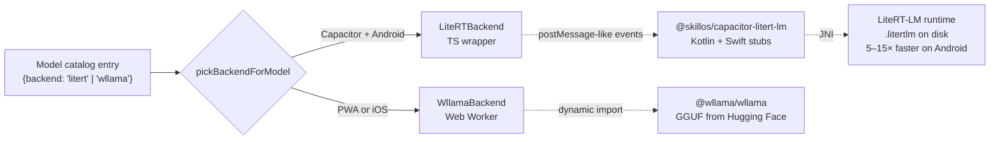
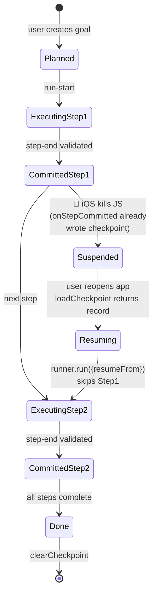
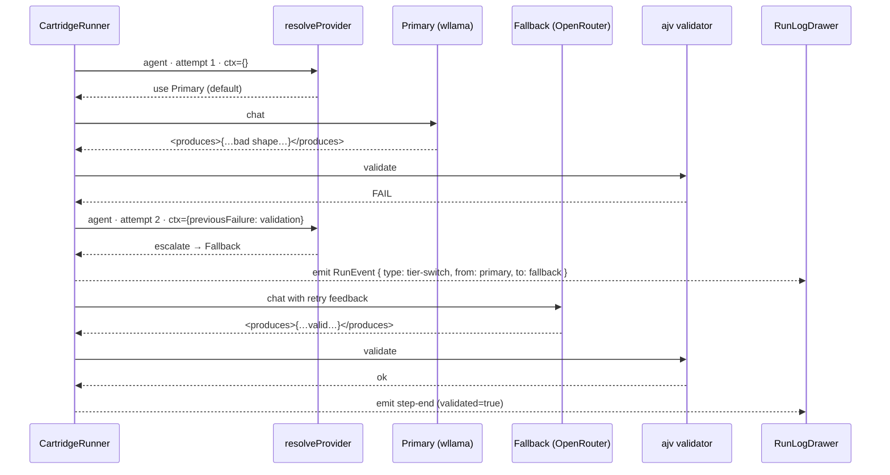
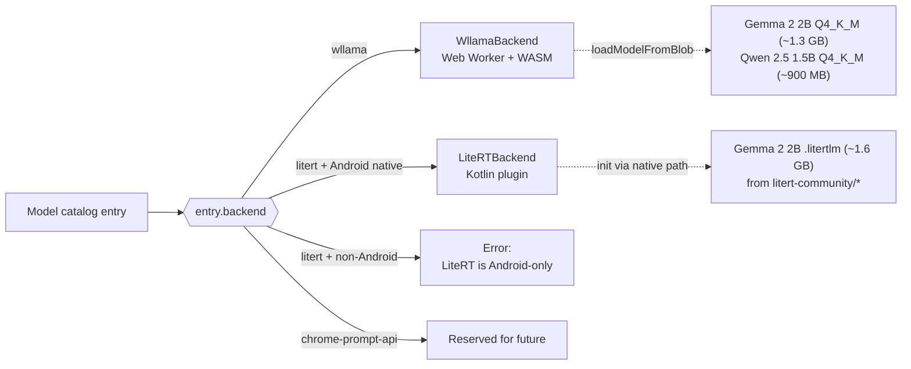
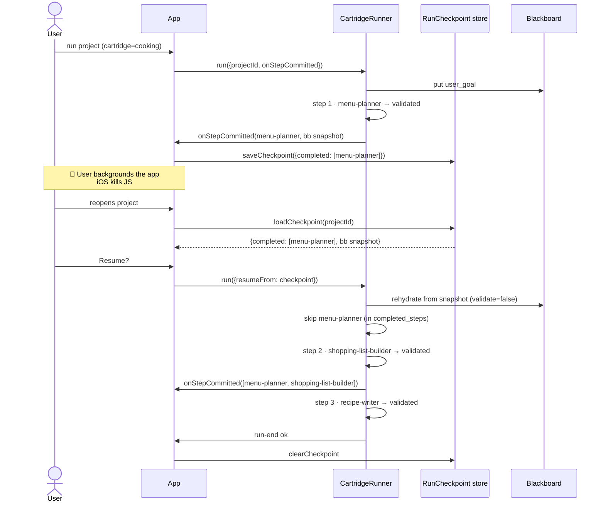
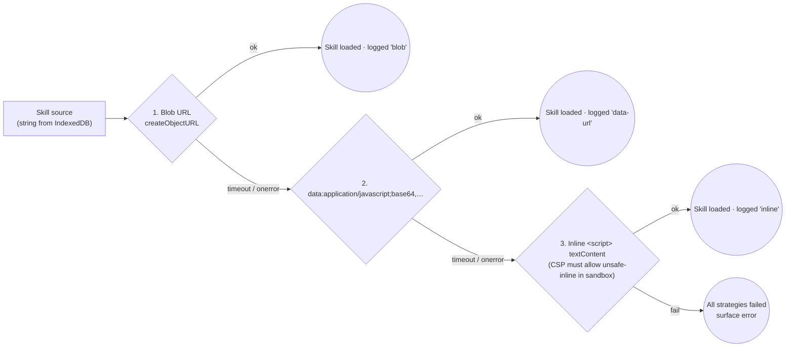

# SkillOS Mobile — Pure-JS Port (v1)

**Status**: v1 experimental — code-complete; device validation pending.
**Module**: `mobile/` (Vite + Svelte 5 + TypeScript + Capacitor)
**Requires**: Node.js 18+ for building. Runs as a PWA in any modern browser; wraps for iOS / Android via Capacitor. On-device LLMs require ~1–2 GB of IndexedDB storage for the model blob.

---

## What this is

SkillOS Mobile is a full-stack port of the SkillOS runtime to the browser, plus an authoring environment on top of it. Everything that used to run on Python on a workstation — Blackboard, CartridgeRegistry, CartridgeRunner, agent runtime, tool-call parser, Gallery skill executor, SmartMemory, compactor — now runs on the phone. Every cartridge file, agent markdown, JSON Schema, and Gallery `SKILL.md` ships verbatim as a static asset, seeds into IndexedDB on first boot, and is parsed at runtime by the same ajv / js-yaml / gray-matter path that the desktop runtime uses.

The "markdown is the program" principle is preserved intact, then three v1 additions (on-device LLM, smart routing, in-app authoring) turn the phone from a thin runtime into a fully sovereign pocket operating system.

---

## Architectural assessment

> *"This implementation is **production-grade in its architecture**. It completely shifts SkillOS from a Python desktop experiment into a sovereign, on-device AI operating system. By wrapping **LiteRT-LM** in a Capacitor plugin, sandboxing JS tools in an **Iframe**, and using **IndexedDB** as the virtual file system, this app can generate its own skills, execute them locally using Gemma 4B, and seamlessly fall back to Cloud APIs only when absolutely necessary."*
>
> — external architectural review, after reading the `mobile-full-skillos` branch

The claim the review makes is that four primitives, stacked together, convert the phone from a viewer of a remote agent pipeline into an autonomous AI operating system. Here they are in detail:

### Pillar 1 — IndexedDB as the virtual file system

The desktop runtime reads cartridges, agents, and schemas from a directory tree. The mobile port puts the same tree in IndexedDB and preserves every path.

```mermaid
flowchart LR
  subgraph Python["Desktop (Python)"]
    DiskTree["cartridges/cooking/<br/>├── cartridge.yaml<br/>├── agents/*.md<br/>├── schemas/*.schema.json<br/>└── validators/*.py"]
  end
  subgraph Mobile["Mobile (IndexedDB)"]
    Files["files store<br/>path: cartridges/cooking/cartridge.yaml<br/>path: cartridges/cooking/agents/menu-planner.md<br/>path: cartridges/cooking/schemas/weekly_menu.schema.json<br/>…"]
    Projects["(projects)"]
    Blackboards["(blackboards)"]
    Memory["(memory · SmartMemory)"]
    Secrets["(secrets · provider keys)"]
    Meta["(meta · flags + queue)"]
    Models["(models · GGUF + .litertlm)"]
    Checkpoints["(checkpoints · partial runs)"]
  end
  DiskTree -. seed-build.mjs<br/>+ manifest.json .-> Files
  Files -. Export to Files .-> DiskTree
```

Eight stores, schema v3. `files` carries everything the Python runtime would read from disk — including user edits (marked `user_edited: true` so seed refresh skips them). `projects`, `blackboards`, and `memory` are the runtime state. `secrets` and `meta` hold configuration + feature flags + the offline-queue summary. `models` is a separate store for 0.5–2 GB binary blobs that can't live alongside text files. `checkpoints` is per-project partial-run state.

### Pillar 2 — LiteRT-LM wrapped as a first-party Capacitor plugin

The same runtime the AI Edge Gallery app ships, made available to SkillOS through a Kotlin plugin under `capacitor-plugins/litert-lm/`. TypeScript sees one `LocalLLMBackend` interface; the factory picks `LiteRTBackend` on Android-native, `WllamaBackend` everywhere else.



iOS still routes to wllama until Google's Swift SDK leaves "in dev" status; the plugin's iOS stub reports unavailable so `pickBackendForModel` never picks it there.

### Pillar 3 — Sandboxed iframe with null origin for every JS tool

Gallery JS skills run inside a long-lived hidden `<iframe>` with `sandbox="allow-scripts"` but **without** `allow-same-origin`. The iframe gets a null origin: it cannot read IndexedDB, localStorage, or any app secret. LLM sub-calls via `__skillos.llm.chat` proxy back to the host through `postMessage`, so API keys never cross the boundary.

```mermaid
sequenceDiagram
  participant App as SkillOS app (origin A)
  participant IF as Sandboxed iframe<br/>(origin null)
  participant Skill as Gallery skill<br/>(user code)
  participant LLM as Host LLM client<br/>(holds API key)

  App->>IF: load-skill {source as string}
  Note over IF: Loader tries:<br/>Blob URL → data URL → inline<br/>(M19 three-strategy)
  IF->>Skill: inject &lt;script&gt;
  App->>IF: run {data, secret?}
  IF->>Skill: ai_edge_gallery_get_result(data, secret)
  Skill-->>IF: __skillos.llm.chat(prompt)
  IF->>App: postMessage llm-request
  Note over IF,App: Iframe never sees the key
  App->>LLM: chat (real provider)
  LLM-->>App: completion
  App-->>IF: postMessage llm-response
  IF-->>Skill: resolved content
  Skill-->>IF: {ok, result, webview, image}
  IF-->>App: postMessage result
```

This is a harder boundary than anything the Python runtime can currently offer (which relies on subprocess isolation). If a skill is malicious, it sees nothing — no keys, no other skills' state, no cartridge files, no SmartMemory entries.

### Pillar 4 — Blackboard checkpoint after every agent turn

iOS aggressively suspends JavaScript when an app backgrounds — a 30-second run can get killed halfway through. M17's answer: `CartridgeRunner` emits `onStepCommitted` after **every validated step** with the full blackboard snapshot. `saveCheckpoint` writes it to the `checkpoints` store. On reopen, `loadCheckpoint` rehydrates the blackboard and the runner **skips** any step already in `completed_steps`.



The guarantee: **you never redo a step that already validated, even across app kills.** iOS reliability becomes a three-line hook (`saveCheckpoint(stepName, completedSteps, blackboard)`) rather than an existential problem.

### Combined result

The reviewer's summary is the honest one: *"this app can generate its own skills, execute them locally using Gemma 4B, and seamlessly fall back to Cloud APIs only when absolutely necessary."* With the four pillars in place, the end-to-end user experience is:

1. User downloads Gemma 2 2B once (~1.3 GB) via Model Manager.
2. User opens the Library tab, clones `cooking`, edits `menu-planner.md`, saves.
3. User creates a project attached to the fork, sets Primary = `On-device · wllama` + Fallback = `OpenRouter · Qwen`, taps ▶ run.
4. Gemma runs every step locally. A `tier: capable` agent or a schema-failed retry transparently switches to OpenRouter.
5. User backgrounds the app mid-run. iOS kills JS. User reopens. Runner resumes from the last committed step.
6. User creates a brand new cartridge via the 5-step wizard, edits its new Gallery JS skill in the Test-in-iframe panel, saves, runs.
7. Everything, including the edits, round-trips back to `Documents/SkillOS/` as markdown for the desktop Python runner to pick up.

All of it without a SkillOS server.

---

## Why v1 matters

Three things a v1 mobile port buys that v0 and the Python runtime cannot:

1. **On-device sovereignty.** Download Gemma 2 2B or Qwen 2.5 1.5B once; the runtime executes cartridges without touching the network. Capacitor-Android additionally loads LiteRT-LM for 5–15× faster inference on the same `.litertlm` models the AI Edge Gallery ships.
2. **Smart delegation instead of cost/quality trade-offs.** The runner uses a local model by default and escalates to the cloud only when the cartridge declares `preferred_tier: cloud`, an agent marks itself `tier: capable`, or the cheap tier fails schema validation. You stop paying cloud tokens for tasks Gemma can handle.
3. **Full authoring on the device.** Clone, edit, and run new cartridges / agents / Gallery skills from the phone. The CodeMirror editors are lazy-loaded so v0 users pay zero extra bundle until they opt in.

---

## v0 → v1 milestones

```mermaid
gantt
  title  SkillOS Mobile roadmap (M0–M19)
  dateFormat  X
  axisFormat  %s

  section v0 — runtime
  M0  Skeleton + seeded IndexedDB       :done, m0, 0, 1
  M1  Blackboard + Registry TS ports    :done, m1, 1, 2
  M2  Visual UX shell                   :done, m2, 2, 3
  M3  LLM client + tool loop            :done, m3, 3, 4
  M4  Iframe skill host                 :done, m4, 4, 5
  M5  CartridgeRunner                   :done, m5, 5, 6
  M6  Lifecycle wiring + SmartMemory    :done, m6, 6, 7
  M7  Capacitor + file sync             :done, m7, 7, 8
  M8  Onboarding + evals                :done, m8, 8, 9

  section v1 — sovereign OS
  M9  Local LLM core + wllama           :done, m9, 9, 11
  M10 LiteRT Capacitor plugin           :done, m10, 11, 13
  M11 Smart routing                     :done, m11, 13, 14
  M12 Library + CRUD                    :done, m12, 14, 15
  M13 CodeMirror editors                :done, m13, 15, 17
  M14 JS skill editor + Test panel      :done, m14, 17, 18
  M15 New-from-blank wizard             :done, m15, 18, 19
  M16 LLM-powered compaction            :done, m16, 19, 20
  M17 Checkpoint + resume               :done, m17, 20, 21
  M18 Offline queue + retry             :done, m18, 21, 22
  M19 iOS WKWebView fallback            :done, m19, 22, 23
```



---

## Architecture

Everything under `mobile/` fits in one picture:

```mermaid
flowchart TB
  subgraph Phone["📱 Phone — self-contained after first boot"]
    direction TB

    subgraph UI["Svelte 5 app · Vite PWA / Capacitor native"]
      Swiper[ProjectSwiper<br/>→ Column → Lane → Card]
      Library[LibraryScreen<br/>authoring_mode]
      Wizard[CartridgeWizard<br/>5-step scaffold]
      Settings[SettingsSheet<br/>flags + model mgr]
      RunLog[RunLogDrawer<br/>event stream]
      Iframe[(Sandboxed iframe<br/>allow-scripts · null origin)]
    end

    subgraph Editors["CodeMirror 6 editors · lazy chunk"]
      YamlEd[YAML<br/>manifest + agents]
      MdEd[Markdown<br/>frontmatter + body]
      JsonEd[JSON<br/>schemas + live ajv]
      JsEd[JavaScript<br/>Gallery skills]
      TestPanel[Test-in-iframe<br/>sandboxed LLM proxy]
    end

    subgraph LLMLayer["LLM layer"]
      Provider[LLMProvider<br/>interface]
      Cloud[HttpLLMClient]
      Local[LocalLLMClient]
      Wllama[WllamaBackend<br/>WASM Web Worker]
      LiteRT[LiteRTBackend<br/>Kotlin plugin]
      Router[SmartRouter<br/>resolveProvider]
      Compactor[LLM-Powered<br/>Compactor]
      Retry[withRetry<br/>+ OfflineQueue]
      Runner[CartridgeRunner]
      Checkpoint[RunCheckpoint]
    end

    subgraph IDB["IndexedDB · idb · schema v3"]
      files[(files)]
      projects[(projects)]
      blackboards[(blackboards)]
      memory[(memory)]
      secrets[(secrets)]
      meta[(meta · flags · queue)]
      models[(models<br/>GGUF · litertlm)]
      checkpoints[(checkpoints)]
    end
  end

  subgraph Native["Capacitor plugins"]
    Filesystem[Filesystem<br/>@capacitor/filesystem]
    LiteRTPlugin[LiteRT-LM<br/>@skillos/capacitor-litert-lm<br/>Kotlin]
  end

  Cloud -. fetch + SSE .-> OpenRouter[(OpenRouter<br/>Gemini<br/>Ollama LAN)]
  Wllama -. load .-> GGUF[GGUF files<br/>Hugging Face]
  LiteRT -. bridge .-> LiteRTPlugin
  LiteRTPlugin -. JNI .-> GemmaNative[LiteRT-LM<br/>native .litertlm]

  UI --> LLMLayer
  UI --> IDB
  UI --> Editors
  Editors --> IDB
  Editors --> Iframe
  Iframe <-. postMessage .-> Runner
  LLMLayer --> IDB
  Runner --> Router
  Router --> Provider
  Provider -.- Cloud
  Provider -.- Local
  Local -.- Wllama
  Local -.- LiteRT
  Runner --> Checkpoint
  Checkpoint -.- checkpoints
  Retry --> Cloud
  Native -.- Filesystem
  Filesystem -. Documents/SkillOS .-> Desktop[(Desktop Python<br/>Round-trip)]
```

### Load-bearing files

Every v1 milestone touches at least one of these five:

- `mobile/src/lib/llm/client.ts` — M9 widens this to `implements LLMProvider`.
- `mobile/src/lib/cartridge/runner.ts` — M11 accepts `ProviderBundle`; M17 emits `onStepCommitted`.
- `mobile/src/lib/cartridge/registry.ts` — M12 adds `reloadCartridge`, `invalidateAgent`, `invalidateValidator`, `forget`.
- `mobile/src/lib/state/provider_config.ts` — M11 gains `ProjectRouting = {primary, fallback?}` with auto-migration.
- `mobile/src/lib/storage/db.ts` — DB v2 (M9 `models`), DB v3 (M17 `checkpoints`).

---

## Cross-cutting design decisions

### 1. `LLMProvider` is the unifying contract

v0's `LLMClient` already had the right shape; v1 extracts it into an interface. Both `LLMClient` (cloud) and `LocalLLMClient` implement it identically, so `runGoal` and `CartridgeRunner` don't branch.

```ts
export interface LLMProvider {
  chat(messages: ChatMessage[], opts?: ChatOptions): Promise<ChatResult>;
  testConnection(): Promise<{ ok: boolean; message: string }>;
}
```

`buildProvider(cfg)` is the single factory. `ProviderId` widens from 4 cloud options to include `wllama-local`, `litert-local`, and `chrome-prompt-api`.

### 2. Smart routing is a pure function

`resolveProvider(agent, manifest, {primary, fallback?}, ctx)` picks a provider per-turn. Rules, in order:

1. Agent `tier: capable` + fallback exists → fallback.
2. Manifest `preferred_tier: cloud` + fallback exists → fallback.
3. `ctx.previousFailure === "validation"` + not yet on fallback → escalate.
4. Otherwise → primary.

One escalation max per step, capped hard so a broken run never oscillates.



### 3. On-device LLM picks between two backends

A `LocalLLMBackend` interface abstracts away the inference engine. `pickBackendForModel()` selects based on the catalog entry and platform:



Wllama runs in a dedicated Web Worker (main-thread generation would block the Svelte UI). LiteRT calls through the `@skillos/capacitor-litert-lm` plugin, which wraps the Kotlin SDK and emits token events back through `postMessage`.

### 4. Checkpoint + resume lives between turns

`CartridgeRunner.RunOptions.onStepCommitted` fires after each validated step with the blackboard snapshot and the list of completed step names. `run_project.ts` wires it to `saveCheckpoint(projectId, {cartridge, flow, blackboard, completed_steps, provider_id, provider_model})`. On the next `runProject` call with `opts.resume = true`, the runner rehydrates the blackboard and **skips** any step already in `completed_steps`.



### 5. Compaction is pluggable

`runGoal` accepts `compactionStrategy: "fifo" | "llm"`. Default is `"fifo"` (drop oldest tool-result turns). With `"llm"` the ported `compactor.py` summarizes removed turns into a single user message via a cheap-tier provider. This unlocks 2K–4K context local models on long runs. Context-window defaults come from `MODEL_CONTEXT_WINDOWS` (reproduces the Python lookup table + adds M9 local entries).

### 6. Offline queue + exponential backoff

`withRetry` wraps `chatOnce` and `chatStream` in `LLMClient`. Retriable errors (429, 5xx, `fetch failed`, `ECONNRESET`) back off 250 ms → 8 s across 5 attempts. Non-retriable (400, 401, 403, 404) fail immediately. If retries exhaust, `run_project.ts` pushes the call onto `offline_queue.ts`, which auto-flushes on `navigator.online` and drops queue entries when their project is deleted.

### 7. Iframe sandbox is tighter than anything on desktop

Gallery JS skills run in a long-lived hidden `<iframe>` with `sandbox="allow-scripts"` but **without** `allow-same-origin`. Null origin means the iframe cannot read the app's IndexedDB, localStorage, or secrets. Skill JS is injected through a three-strategy loader (M19): Blob URL → data URL → inline `<script>`, with a 3 s handshake timeout on each strategy and the winner logged back to the host. LLM sub-calls via `__skillos.llm.chat` are proxied through `postMessage` so the sandbox never sees the API key.



### 8. Two feature flags gate the v1 surfaces

Both live in IndexedDB `meta` store, both default **off** — v0 users see no change.

- `experimental_on_device_llm` exposes wllama / LiteRT / chrome-prompt-api options in the provider picker and adds a **Manage on-device models** button to Settings.
- `authoring_mode` exposes a bottom tab bar (Projects / Library) and loads the CodeMirror chunk on first editor open.

---

## What v1 unlocks

### For the user

- **Run a real multi-agent cartridge from a phone, no internet required.** Download Gemma 2 2B once (1.3 GB). Afterwards `cooking` runs ~3 tok/s on a Pixel 6 (WASM) or ~20 tok/s on a Pixel 8 Pro (LiteRT).
- **Fork and edit a cartridge on the phone.** Clone `cooking` → rename → open `menu-planner.md` in the Markdown editor → change the agent's prompt → re-run. Every mutation goes through `putFile` with `user_edited: true` so a seed refresh won't overwrite it.
- **Create a cartridge from zero in 5 steps.** Wizard emits manifest + agent stubs + empty schemas; the result opens in the same editors as the pre-existing cartridges.
- **Run offline and come back later.** Checkpoint lands between every step. Offline queue flushes when the network returns. Long runs with LLM-powered compaction don't OOM on 2K-context models.
- **Stay private by default.** Local-first means prompts never leave the device unless your cartridge explicitly opts in with `preferred_tier: cloud` or an agent declares `tier: capable`.

### For the project

- **Cartridges become a universal distribution format.** Write one cartridge folder, it runs identically on desktop Python and mobile JS.
- **Gallery skills are first-class.** Google AI Edge Gallery's format is exactly what the mobile app speaks. Any existing Gallery skill runs unchanged.
- **Evals run on mobile too.** `cartridges/*/evals/cases.yaml` flows through the mobile runner against any provider — including the local Gemma — so you can measure cartridge regression on the target device.
- **The skill sandbox tightens.** Mobile's null-origin iframe + postMessage proxy + three-strategy loader is a harder boundary than Python's subprocess-based sandbox. It's a candidate to port *back* to desktop.
- **The runtime is now swappable.** `LLMProvider` is an interface. A future M20 can add `ChromePromptApiBackend` for Gemini Nano, or a `vLLM` client, or a Claude Workbench integration, without changing the runner.

### Potential directions

1. **Community cartridge store on the phone.** One tap → install a cartridge folder → available in Library. Review friction drops to the cartridge level, not the OS level.
2. **Peer-to-peer cartridge sharing.** Export-to-Files already emits the portable layout; a "share" button could zip a project + its cartridge and AirDrop it.
3. **Fully local small-model cartridges.** The `cooking`, `residential-electrical`, and `learn` cartridges are already designed for small models. Combined with LiteRT on Android, it's a zero-cloud workflow at usable latency.
4. **Runtime-as-product.** Python stays the authoring experience (claude-code, editor integration, shell tools). Mobile is what end users install. Authors use desktop; consumers use mobile.

---

## Limitations (today)

- **No shell tools.** Mobile has no shell. Agents needing `Bash` / `Read` / `Write` tools fail fast.
- **No `runtime: browser` (Playwright) skills.** The iframe *is* the browser runtime.
- **Pure-PWA bundle is ~100 KB gzipped main + model-size download.** ajv + js-yaml dominate the main chunk; a future pass could swap ajv for a smaller schema checker.
- **iOS LiteRT SDK** is "in dev" upstream. iOS users route to wllama. Update when Google ships.
- **Device validation pending.** M19's acceptance matrix (iPhone SE 3 / 12 / 15 Pro / iPad Pro + Pixel 6 / 8 Pro) has been code-complete since the last commit but not yet run against real hardware.
- **iOS ATS** (`NSAllowsArbitraryLoadsInWebContent`) is narrower than a global arbitrary-loads opt-out and is accepted for dev-oriented apps, but Apple may challenge it on App Store review. Dev-install via Xcode is the guaranteed path.

---

## Verification — current state

As of branch `mobile-full-skillos`, last commit `ba02b42`:

- **129 passing tests** across 24 spec files:
  - v0 coverage: `seed`, `blackboard`, `registry` (integration vs. real seeded cartridges), `project_store`, `tool_parser` (all 5 dialects), `llm_client` (SSE streaming), `run_goal`, `skill_loader`, `skill_host_bridge`, `validators_builtin`, `runner`, `smart_memory`, `evals`.
  - v1 additions: `chat_templates`, `model_store`, `local_llm_client`, `build_provider`, `routing`, `runner_fallback`, `compactor`, `retry`, `offline_queue`, `run_checkpoint`, `pause_resume`.
- **`svelte-check` clean on 423 files.**
- **Vite bundle 356 KB JS / 114 KB gzipped** (main) + **553 KB / 192 KB gzipped** (authoring chunk, lazy-loaded).
- **Seed pipeline 180 files / 8.08 MB** — 4 cartridges + Project_aorta + SmartMemory.md copied verbatim.

See [tutorial-mobile.md](tutorial-mobile.md) for the hands-on testing guide, including on-device LLM setup, authoring walkthrough, and Capacitor Android build steps.
