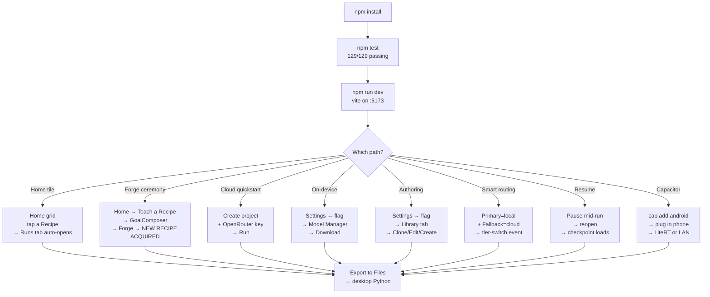
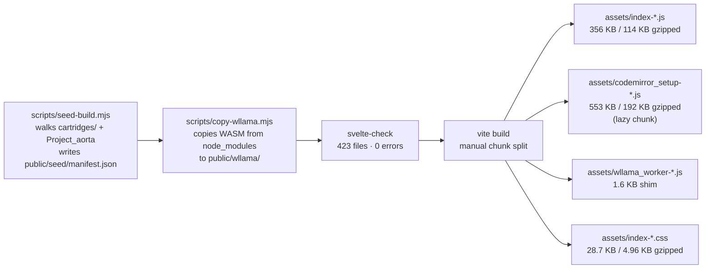
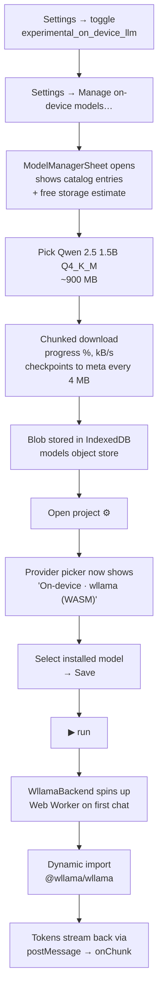
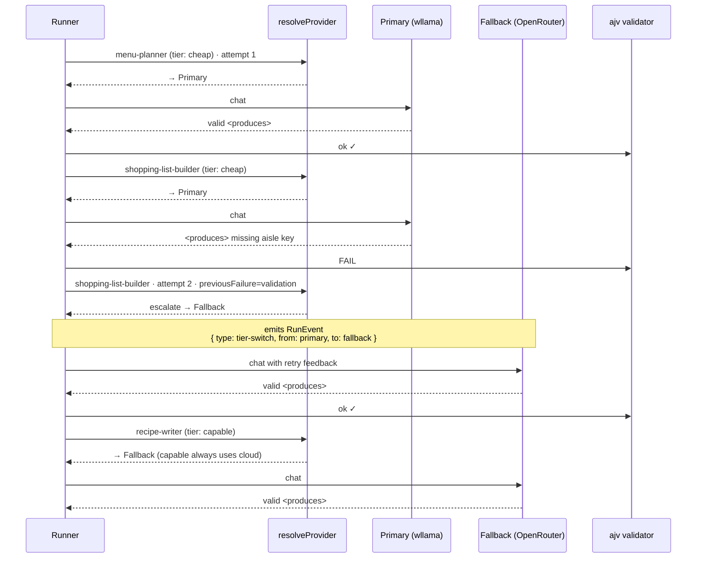
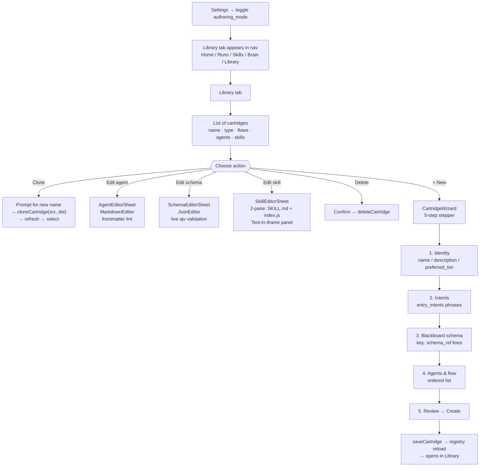
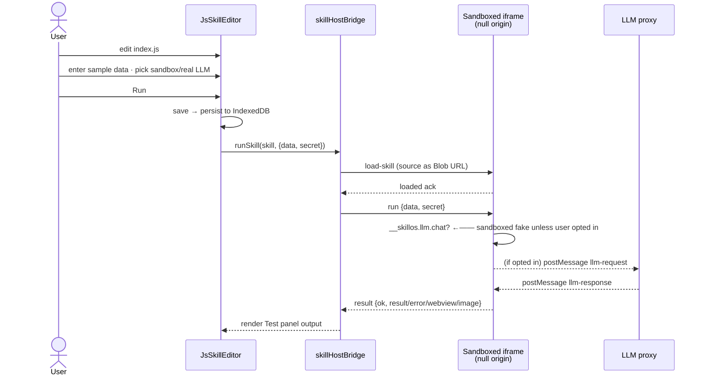
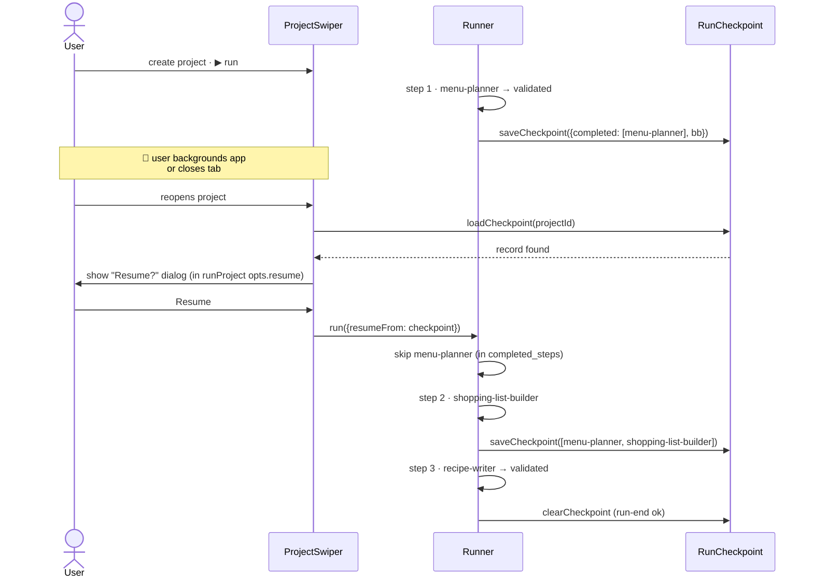
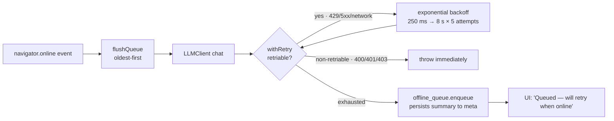
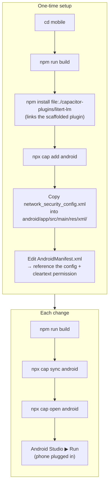

# Tutorial — Testing SkillOS Mobile (v1)

End-to-end walkthrough for exercising the `mobile/` app locally against every v1 capability: dev server in a browser, real cartridge run against a cloud provider, on-device LLM, in-app authoring, smart routing with fallback, pause / resume across app lifecycle, Capacitor Android build with LiteRT-LM, and round-trip file sync back to the desktop Python runtime.

> Each section below exercises exactly one of the four architectural pillars the mobile port stands on: **IndexedDB as virtual filesystem** (§1, §5, §11), **LiteRT-LM Capacitor plugin + wllama WASM fallback** (§3, §9), **null-origin sandboxed iframe for JS tools** (§5.3, §10), and **Blackboard checkpoint after every turn** (§6). By the end you will have generated a cartridge on the phone, run it locally on Gemma, escalated to the cloud on a schema failure, and resumed from a checkpoint — without any SkillOS server.

Estimated time: 30 minutes for the browser paths. 90 minutes additional if you walk through the Capacitor Android build. iOS device validation requires hardware.

> **For hands-on, tab-by-tab feature testing** (Skills tab, Brain tab, Promote to Skill, Provenance badges, etc.), see [`mobile-testing-guide.md`](./mobile-testing-guide.md). That guide is a practical checklist; this document is the architectural walkthrough + Capacitor build path.

---

## Prerequisites

| What | Version | Notes |
|---|---|---|
| Node.js | 18 LTS or 20 LTS | Builds the web bundle and runs tests |
| Python (optional) | 3.11+ | Only for round-trip-to-desktop |
| Ollama (optional) | latest | Only for LAN-LLM smoke. `ollama pull gemma2:2b` works on most laptops |
| Android Studio (optional) | latest | For Capacitor APK builds + LiteRT plugin |
| Xcode (optional) | latest | For Capacitor iOS builds |
| OpenRouter or Gemini API key | — | Easiest cloud provider for the initial PWA smoke |
| Modern phone (optional) | ≥ 4 GB RAM for on-device Gemma | Otherwise Qwen 1.5B still fits |

No Android Studio / Xcode needed for the browser paths.

---

## 0. The big picture



> **Tab-order note (v1+recipe-reframe)**: bottom nav is now **Home · Runs · Skills · Brain · (Library)**. Default landing is **Home** — a grid of recipe tiles, category-grouped, with a dashed "Teach a Recipe" tile that triggers the Forge ceremony for unmatched goals. The old Projects swiper lives under the **Runs** tab with the same functionality; only the entry point moved. See [`mobile-testing-guide.md`](./mobile-testing-guide.md) for the hands-on per-tab checklist.

---

## 1. Install + build

```bash
git clone https://github.com/EvolvingAgentsLabs/skillos.git
cd skillos/mobile
npm install              # ~1 min
```

### Smoke check

```bash
npm test                 # 129 tests across 24 spec files
```

Expected: `Test Files 24 passed · Tests 129 passed`.

### Production build

```bash
npm run build
```

Pipeline runs three stages:



The authoring chunk is only downloaded when `authoring_mode` is toggled on. First-time v0 users pay ~114 KB gzipped for the main JS bundle.

### Optional seed flags

Default ships every cartridge but only `Project_aorta`. To pull all projects in:

```bash
node scripts/seed-build.mjs --all-projects
node scripts/seed-build.mjs --projects=Project_aorta,Project_echo_q
```

---

## 2. Browser smoke — cloud provider

The fastest v0 path. Works on any laptop browser; no phone required.

```bash
cd skillos/mobile
npm run dev              # http://localhost:5173
```

1. Open in Chrome (optionally toggle DevTools → device toolbar to emulate a phone).
2. Splash: *"Seeding 180 / 180 files…"* (~2 s).
3. **First launch only** — a 4-page onboarding dialog frames SkillOS around Recipes (composition of plan + agents + skills + memory), explains the run loop, and covers write-once/run-forever-locally. Tap **Next** through it or **Skip**. It never reappears (stored under `meta.onboarding_seen`).
4. You land on **Home** — a category-grouped grid of recipe tiles (one per cartridge).
5. **Path A — pick an existing Recipe from Home:**
    - Tap a tile under `cooking` (or any category).
    - The app switches to the **Runs** tab. Because no provider is configured yet, the ProviderSettingsSheet opens automatically.
    - Fill the **Primary** tab: `OpenRouter · Qwen` or `Google · Gemini`, API key, optional model. Leave **Fallback** off for now (§4 covers it). Save.
    - The run starts immediately.
6. **Path B — explicit goal → Runs tab:**
    - Switch to the **Runs** tab → tap **+** top-right.
    - *Name*: `Sunday menu`
    - *Cartridge*: leave auto-picker on and type a goal like `Plan weekly meals for 2 adults, vegetarian`. Tap **Plan with SkillOS** — the router picks `cooking`.
    - **Create**, configure provider (step 5 above), **▶ run**.

What you'll see in either path:

- The **Composition Stepper** renders in the bottom drawer by default — one entry per agent, active step pulsing, tier badge (⚡ local / ☁ cloud).
- 🎯 Goal card slides to **In Execution**.
- 🤖 **menu-planner** enters **In Execution** with "running…" subtitle.
- Tapping **Details** in the drawer header flips to the raw event log (LLM tokens live, tool-call chips, validator pings) — same content as the pre-reframe RunLogDrawer.
- On schema-validated `<produces>`, a 📄 **weekly_menu** card lands in **Done**.
- Same for `shopping-list-builder` → 📄 `shopping_list`, then `recipe-writer` → 📄 `recipes`.
- Validators fire at the end (`menu_complete.py` + `shopping_list_sane.py`) and report `ok` in the details log.
- 🎯 Goal card moves to **Done**.
- Expand the `weekly_menu` done card → it renders with the **typed schedule renderer** (day-grouped list), not raw JSON. Toggle **Raw JSON** to see the underlying payload.

### Optional: Forge ceremony (capability gap)

1. Return to **Home** → scroll to the dashed **Teach a Recipe** tile at the bottom.
2. Tap it → GoalComposer opens. Type a goal that won't match any installed cartridge, e.g. `"convert my timestamps from UTC to Buenos Aires and format them for my kids' school"`.
3. **Plan with SkillOS** → the router returns a synthesize decision.
4. Tap the new **✨ Teach me this Recipe** button → **ForgeRecipeSheet** opens with: goal echo, 3-step proposed plan, one-time cost estimate (~$0.01–0.03).
5. Tap **✨ Teach me**. Watch the spinner, then the animated **NEW RECIPE ACQUIRED** ribbon.
6. **Use it now** → creates a project pinned to the just-forged skill.

### Optional: Teach this Recipe (post-run refinement)

After any successful run, a **✎** icon appears in the Runs-tab project header. Tap it → **TeachRecipeSheet** → type a correction like `round totals up to 2 decimals` → save. The cartridge's header now shows `· learned 1` and the Home tile for that cartridge picks up a `learned 1` patina chip.

> **Scope note**: teachings are stored + displayed today. They aren't yet injected into agent prompts at runtime — that plumbing is a follow-up. The capture/display loop is testable end-to-end regardless.

---

## 3. On-device LLM (wllama WASM)



**Step-by-step:**

1. Open the app → brand (top-left) → **Settings**.
2. Toggle **On-device LLM providers**.
3. Tap **Manage on-device models…** → pick `Qwen 2.5 · 1.5B · Q4_K_M` → **Download**. Watch the progress bar. If it dies (network, tab-background), reopen and tap Download again — it resumes from the byte offset stored in `meta`.
4. Close Settings. Create / open a project attached to `cooking`.
5. Tap **⚙** → *Provider* = `On-device · wllama (WASM)` → *Model* = the entry you just installed → **Save**.
6. Tap **▶ run**.

**Expected performance** (Chrome DevTools mobile emulation on a laptop):

| Device class | tok/s | Note |
|---|---:|---|
| Desktop Chrome (SAB enabled) | 15–30 | Multi-thread WASM build |
| iOS Safari PWA (no SAB) | 3–8 | Single-thread fallback; badge shows "slower mode" |
| Pixel 6 (PWA) | 4–10 | single-thread; wasm-simd helps |
| Pixel 8 Pro (Capacitor + LiteRT) | 20–40 | **native plugin path, M10** |

Remember: **the first token takes 5–15 s** while wllama loads the model into memory. Subsequent turns reuse the loaded model.

### Troubleshooting

| Symptom | Likely cause | Fix |
|---|---|---|
| "insufficient storage" on download | `navigator.storage.estimate()` reports < 2× model size | Free up space or pick the smaller Qwen 1.5B |
| 0 tok/s and the tab hangs | Running on main thread (worker failed to spawn) | Check DevTools console for worker errors; iOS Safari sometimes blocks file: workers — reload as installed PWA |
| Output looks like gibberish | Wrong chat template | Verify the catalog entry — each model has a pinned template (`gemma-v2`, `qwen2`, `llama3`, etc.) |
| "LiteRT plugin not installed" | Picked `litert-local` in pure PWA | Switch to `wllama-local`; LiteRT requires the Capacitor native build |

---

## 4. Smart routing — local primary + cloud fallback

The v1 killer feature. Run Gemma locally 90% of the time; delegate to Claude/Qwen only when needed.



### Try it

1. Install Qwen 1.5B via Model Manager (see §3).
2. On any `cooking` project, tap **⚙** — the Provider sheet opens with two tabs: **Primary** and **Fallback (off)**.
3. On the **Primary** tab:
    - *Provider*: `On-device · wllama (WASM)` (requires `experimental_on_device_llm` toggle on — see §3)
    - *Model*: pick your installed model
4. Tap the **Fallback** tab:
    - Tick **Enable a fallback provider for this project**
    - *Provider*: `OpenRouter · Qwen`
    - *API key*: paste your cloud key
5. **Save**. The tab label updates to **Fallback ✓** and the runtime now knows both ends.
6. (Optional) Via the Library (see §5), edit `recipe-writer.md` and add `tier: capable` to its frontmatter so it always routes through the fallback.
7. **▶ run** and watch the RunLogDrawer — look for a row that reads `↪ tier-switch · primary → fallback (reason: …)` right before the step retries.

### Common pairings the app suggests

| Primary | Fallback | When to use |
|---|---|---|
| `On-device · wllama` (Qwen 1.5B) | `OpenRouter · Qwen` (free tier) | Fully private default, cloud only on schema failures |
| `On-device · LiteRT` (Gemma 2 2B) | `OpenRouter · Gemma` (free) | Android-native speed with cloud-Gemma backstop |
| `OpenRouter · Qwen` (free) | `Google · Gemini` | Cheap default, capable escalation |
| `Ollama (LAN)` | `OpenRouter · Qwen` | Laptop-GPU default, cloud if LAN unreachable |

---

## 5. In-app authoring



### Clone-and-tweak walkthrough (5 min)

1. **Settings** → toggle **Authoring mode**.
2. Bottom tab bar → **Library**.
3. Tap `cooking` → *Clone…* → enter `my-cooking` → **OK**.
4. The cloned cartridge appears at the top, auto-selected. Tap `menu-planner` in the Agents section.
5. `AgentEditorSheet` opens with CodeMirror. Edit the body (e.g., add "emphasize quick recipes" to the prompt). Lint markers appear immediately if the frontmatter becomes malformed.
6. Tap **Save**.
7. Back in Projects, create a new project attached to `my-cooking` → **▶ run** → observe the new body influences the menu planning output.

### New-from-blank cartridge (10 min)

1. Library → **+ New** → wizard opens.
2. **Identity**: name = `weekend-planner`, description = "Plan a 2-day outing", preferred_tier = `auto`.
3. **Intents**: paste `plan my weekend` and `saturday itinerary`.
4. **Blackboard**: paste `itinerary: itinerary.schema.json`.
5. **Agents**: paste `day-planner` and `activity-finder`.
6. **Review** → **Create**.
7. The new cartridge appears in the Library with a "draft" feel (no real prompts yet). Tap each agent → replace the stub body with the real prompt.
8. Tap the schema `itinerary.schema.json` → replace the empty skeleton with the real JSON Schema.
9. Create a Projects-tab project attached to `weekend-planner` → **▶ run**.

### JS skill editing + Test-in-iframe (5 min)



1. Library → `demo` → tap `calculate-hash` in the Gallery skills section.
2. SkillEditorSheet opens with SKILL.md on one tab, index.js on the other.
3. Change a constant (e.g., the hash algorithm name or a return message).
4. In the Test panel:
   - *sample data*: `{"text":"hello"}`
   - Leave "Use real provider" **unchecked** (sandboxed LLM echo)
   - **Run**
5. Output shows `{ ok: true, result: "<sha1 of hello>" }`.
6. **Save** to persist.

---

## 6. Pause + resume



### Try it

1. Start a `cooking` run against any provider (cloud is fine).
2. After the RunLogDrawer shows `step-end` for `menu-planner` (first agent), close the browser tab.
3. Reopen `http://localhost:5173`. The project shows a ⏸ badge.
4. Tap it, then tap **▶ run** with `opts.resume = true` (the UI wires it automatically if `loadCheckpoint` returns a record).
5. The run resumes — watch the log: no `step-start` for `menu-planner`, it goes straight to `shopping-list-builder`. The final `weekly_menu` document card from the paused run is still in the Done lane.

---

## 7. Offline queue



### Try it

1. Start a cloud run.
2. Mid-run, disable wifi / turn off airplane mode / block the OpenRouter host in DevTools.
3. Toast appears: "Queued — will retry when online".
4. Re-enable wifi. Queue drains automatically. Run continues.

---

## 7.5. Other things the app does

Small flows that round out the feature set. Each maps to one concrete UI affordance — worth knowing so you don't re-invent them.

| Flow | Where | Notes |
|---|---|---|
| **Onboarding tutorial** | First launch; 4-page dismissable dialog | Sets `meta.onboarding_seen`. Never blocks the app. |
| **Resync from bundle** | Settings → *Resync from bundle* | Force-reloads seeded files from `public/seed/`. User-edited files are preserved (they carry `user_edited: true` in IndexedDB and are skipped on resync). Useful after editing a cartridge on disk + rebuilding. |
| **Delete cartridge** | Library → pick cartridge → *Delete* (confirms) | Removes every `cartridges/<name>/…` path from IndexedDB and drops the registry entry. Doesn't touch projects that used it — those will throw "unknown cartridge" on next run unless you reassign. |
| **Manual card lane moves** | Tap any card → chevron expands → **→ Planned / → In Execution / → Done / Delete** | Useful for experimenting with goal-card state before a real run, or cleaning up after a failure. |
| **Quick + card on a column** | Column header → **+ card** | Adds a blank Goal card in *Planned*. Tap the card to rename. |
| **Swipe between projects** | Horizontal swipe, or pager dots in the top bar | One project per viewport. `overscroll-behavior: contain` keeps iOS rubber-band from fighting the snap. |
| **Run log drawer** | Bottom of the screen during / after a run | Streams every RunEvent: assistant deltas, tool calls, validator messages, `tier-switch`. Persists the last run until the next one starts. |
| **Card raw payload** | Tap card → expand chevron → JSON pane | Shows the full `<produces>` JSON or skill result for debugging. |
| **SmartMemory log** | Persisted per-project on every run-end | No dedicated UI yet (planned for v2). Entries round-trip through Export to Files (§11) as YAML-frontmatter markdown in `system/SmartMemory.md`. |
| **Offline queue view** | Persisted summary at `meta.offline_queue` | No dedicated UI yet. Inspect via DevTools → Application → IndexedDB → `skillos` → `meta`. |

---

## 8. Evals harness

Runs every cartridge's `cases.yaml` through the mobile runner against your configured provider.

1. From any project, tap the **SkillOS** brand (top-left).
2. **Settings → Run cartridge evals…**.
3. **Run all**.

Each case shows ✓/✗, per-assertion diff on failures, and per-case duration. A typical OpenRouter Qwen run completes all cooking + electrical cases in about a minute.

---

## 9. Capacitor Android build (LiteRT-LM)

This is the path that unlocks native-accelerated inference. Gemma 2 2B at 20+ tok/s on a Pixel 8 Pro.



### 9.1 Add the plugin

```bash
cd skillos/mobile
npm run build
npm install file:./capacitor-plugins/litert-lm
npx cap add android
```

### 9.2 Wire LAN + LiteRT cleartext

```bash
mkdir -p android/app/src/main/res/xml
cp capacitor-resources/android/network_security_config.xml \
   android/app/src/main/res/xml/
```

Open `android/app/src/main/AndroidManifest.xml`, find the `<application …>` tag, and add:

```xml
<application
    android:networkSecurityConfig="@xml/network_security_config"
    android:usesCleartextTraffic="true"
    ... >
```

### 9.3 Push + run

```bash
npx cap sync android
npx cap open android
# In Android Studio: device plugged in · USB debugging on · ▶
```

### 9.4 LiteRT walkthrough

1. Install the APK, launch the app.
2. **Settings** → toggle **On-device LLM providers**.
3. **Manage on-device models…** → the catalog now shows `Gemma 2 · 2B · LiteRT (Android only)` as available. Download (~1.6 GB).
4. Open any project → **⚙** → Provider = `On-device · LiteRT (Android)` → Save.
5. **▶ run**.
6. Watch the log — a debug event indicates "Running on LiteRT" (vs. "Running on wllama"). Tok/s should be substantially higher than WASM.

### 9.5 Alternative: LAN Ollama

On the laptop:

```bash
# macOS / Linux
OLLAMA_HOST=0.0.0.0 OLLAMA_ORIGINS='*' ollama serve

# Windows PowerShell
$env:OLLAMA_HOST = "0.0.0.0"; $env:OLLAMA_ORIGINS = "*"; ollama serve

# in another shell
ollama pull gemma2:2b
```

In the mobile app: ⚙ → Provider = `Ollama (LAN)` → Base URL = `http://<laptop-LAN-IP>:11434/v1` → Model = `gemma2:2b` → Save → ▶ run.

---

## 10. iOS sketch

iOS LiteRT is still upstream work; use wllama on iOS.

```bash
npx cap add ios
npx cap open ios
# Xcode: merge capacitor-resources/ios/Info.plist.fragment into
# ios/App/App/Info.plist, set signing team, iPhone plugged in, ▶
```

M19's three-strategy script loader runs inside `skill-host.html`. On first skill invocation, the DevTools console shows one of:

- `loader:blob-url` — default path; should hit on iOS 17+
- `loader:data-url` — fallback if Blob URLs are flaky
- `loader:inline` — last resort; works everywhere

The chosen strategy is cached per-device for subsequent loads.

### iOS device matrix (M19 acceptance gate — still pending hardware)

- [ ] iPhone SE (3rd gen) — minimum supported
- [ ] iPhone 12 — mid-range
- [ ] iPhone 15 Pro — high-end
- [ ] iPad Pro — large viewport

For each: PWA install (from Safari share sheet), seed, download Qwen 1.5B, run `cooking` cartridge, clone + edit an agent, create + run a blank cartridge, verify logged iframe strategy.

---

## 11. Round-trip to the desktop Python runtime

Works only from the Capacitor builds (pure-PWA browsers can't write to `Documents/`).

### Export

1. Run a cartridge end-to-end so a project has cards + SmartMemory entries.
2. Brand (top-left) → **Settings** → **Export to Files…**.
3. Status: `exported N files → DOCUMENTS/SkillOS`.

### The emitted folder

```
Documents/SkillOS/
├── cartridges/**/           # every seeded + user-edited file
├── projects/
│   └── <project-name>/
│       ├── state/pipeline_state.md
│       └── cards/
│           ├── card_<id1>.md    # Goal
│           ├── card_<id2>.md    # Agent (from runner events)
│           ├── card_<id3>.md    # Document (from blackboard-put)
│           └── …
└── system/SmartMemory.md
```

Shapes match the desktop Python runtime's expectations — `pipeline_state.md` frontmatter mirrors `projects/Project_aorta/state/pipeline_state.md`. `SmartMemory.md` uses the same `experience_id`/`timestamp`/`project`/`goal`/`outcome` frontmatter the Python `SmartMemory` emits.

### Import

Put an edited `Documents/SkillOS/` tree back on the device, then **Settings → Import from Files…**. Text files (`.md`/`.yaml`/`.json`/`.js`) flow into IndexedDB `files`. The `projects` store isn't overwritten; delete + reimport if you need a full reset.

---

## 12. Pre-release checklist

Before merging a change that touches the mobile stack:

- [ ] `cd mobile && npm test` — 129/129 pass
- [ ] `cd mobile && npm run build` — 0 errors, main bundle ≤ 400 KB (gzipped ≤ 120 KB), authoring chunk ≤ 600 KB (gzipped ≤ 200 KB)
- [ ] Fresh-boot lands on **Home**, four-tab nav visible (§2)
- [ ] Home tile activation opens Runs tab and starts a run (or prompts for provider) (§2 Path A)
- [ ] Browser quickstart (§2) — cloud run end-to-end
- [ ] Composition Stepper shows active pulse + tier badge per step; **Details** toggle round-trips (§2)
- [ ] Typed done-card renderer picks the right view (table/schedule/reader) with Raw JSON escape hatch (§2)
- [ ] Teach Recipe (§2 optional) — teaching saves, patina appears on Home tile + Skills group
- [ ] Forge ceremony (§2 optional) — unmatched goal → sheet → NEW RECIPE ACQUIRED reveal; forged skill runnable from Skills tab
- [ ] Offline banner appears on `navigator.offline` and disappears on reconnect
- [ ] Brain Recipes-mode cluster shows teachings + runs for the affected cartridge
- [ ] On-device quickstart (§3) — wllama Qwen 1.5B runs cooking
- [ ] Smart routing (§4) — observe `tier-switch` event in the Details log
- [ ] Authoring clone-and-tweak (§5) — edited agent body influences output
- [ ] New-from-blank cartridge via wizard — emits valid manifest + agent stubs
- [ ] JS skill editor Test-in-iframe (§5) — sandboxed run completes without errors
- [ ] Pause + resume (§6) — checkpoint survives tab close
- [ ] Offline queue (§7) — "Queued" toast appears + flushes
- [ ] DB upgrade v3→v4 on a pre-upgrade install: no data loss, `teachings` store appears
- [ ] (On hardware) Capacitor Android LiteRT path (§9) — tok/s recorded
- [ ] (On hardware) iOS device matrix (§10) — logged strategy per device

File issues against the repo if any step diverges.
